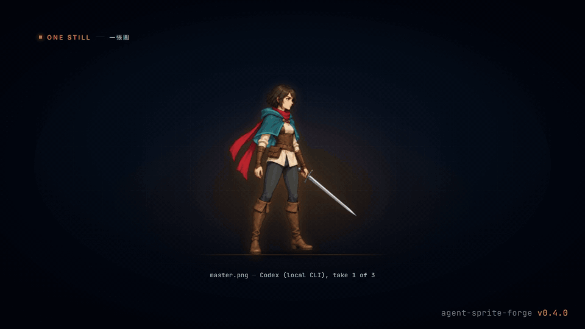

# Agent Sprite Forge

언어: [English](./README.md) | [繁體中文](./README.zh-TW.md) | [简体中文](./README.zh-CN.md) | [日本語](./README.ja.md) | [한국어](./README.ko.md)

<p align="center">
  
</p>

<p align="center">
  
  <br />
  <em>0.4 티저: 모든 프레임이 ASF의 실제 출력입니다.</em>
</p>

> 이 페이지는 영어판과 동기화된 요약입니다. 자세한 설명은 [English README](./README.md)를 기준으로 합니다(繁體中文은 전체 번역).

## 원화 한 장 → 게임에 바로 쓰는 스프라이트 한 세트

**Claude Code**(플러그인), **Codex**, **Grok**용 에이전트 skills입니다. 에이전트가 가장 좋은 이미지 생성 경로로 원화(master still) 한 장을 만들고, 그 원화에서 액션마다 image-to-video 영상을 하나씩 생성합니다. 결정적인 Python 도구가 각 액션을 검사, 키잉, 정렬, 루프 선택, 리타임, 마무리(finish), 패키징해 Godot, Aseprite, 웹 게임으로 넘깁니다.

<p align="center">
  
  <br />
  
  <br />
  <em>원화 한 장(로컬 Codex CLI로 생성) → 액션마다 Grok image-to-video → 여섯 액션. 모든 프레임은 2026-10-06 실제 실행의 출력입니다.</em>
</p>

## 0.4 새 기능: 대규모 업그레이드

| 실제 실행에서 측정 | 이전 | 0.4 |
|---|---:|---:|
| 픽셀 여우(48x64, 8프레임): 프레임당 색 수 | 594–709 | **16–19** |
| 픽셀 여우: 알파 단계 / 프레임당 고립 픽셀(평균) | 199 / 732 | **2 / 75** |
| 키잉: 보라색 테두리(외곽 색 번짐, 평균) | 0.704 | **0** |
| 키잉: 145프레임에서 새어 나온 키 픽셀 / 처리 시간 | 7,780 / 271초 | **0 / 44초** |
| 공격: 원샷 길이 | 4.1초 | **0.7초** |
| 컬러 락: 인접 프레임 사이 색상 반전(달리기 루프) | 352 | **170** |
| QC: 잘못 탈락한 좋은 테이크 | 24개 중 18개 | **24개 중 0개** |

- **이미지 생성 우선:** 모든 이미지와 영상은 `route_media.py`를 거칩니다. 설정된 API 키(OpenAI, Google Gemini, xAI, BytePlus, fal.ai) → 로그인된 로컬 Codex / Grok CLI → 마지막 수단으로 코드 아트(codeart2d).
- **원화 한 장:** `master_still.py`가 후보를 생성하고 편집으로 고친 뒤 `master.json`으로 승인합니다.
- **액션 한 세트:** `sprite_set.py`가 액션마다 영상을 생성하고 자동 QC와 리테이크, 소프트 매트(보라색 테두리 없음), 정렬, 루프 자동 선택, 원샷 자동 리타임, HD 컬러 락, 기본 HD 마무리(요청 시 선명한 픽셀 마무리), 엔진 내보내기까지 처리합니다.
- **엔진 내보내기:** animation.json 3.0, PNG 아틀라스, WebM alpha, packed MP4, Godot SpriteFrames / Sprite3D, Aseprite JSON. 맵은 Tiled, Godot, LDtk.

전후 비교 이미지와 자세한 설명: [What's new](./README.md#whats-new-in-04--the-big-upgrade), [CHANGELOG](./CHANGELOG.md), [실행 기록](./docs/validation-2026-10-06.md).

## 빠른 시작

1. **설치.** Claude Code:

   ```bash
   claude plugin marketplace add 0x0funky/agent-sprite-forge --sparse .claude-plugin skills
   claude plugin install agent-sprite-forge@agent-sprite-forge
   python -m pip install "numpy>=1.26" "Pillow>=10.1" "scipy>=1.11"
   ```

   Codex / Grok: `git clone https://github.com/0x0funky/agent-sprite-forge.git`, `python -m pip install -r requirements.txt`, 이어서 `python tools/install_skills.py --apply --host codex`(Grok은 `--host grok`). 영상에는 ffmpeg 5.1+가 필요합니다.
2. **원화:** `Use $generate2dsprite to make a master still of <당신의 캐릭터>, side view, facing right, HD.`
3. **액션 한 세트:** `Use $video2dsprite to animate the approved master: idle, walk, run, attack, jump and hurt.`

## 생성 경로와 API 키

| 순서 | 경로 | 사용 시점 |
|---|---|---|
| 1 | API: 설정된 키(OpenAI, Gemini, xAI, BytePlus, fal.ai: Kling v3, Veo 3.1, Luma, MiniMax, Wan, Vidu, LTX) | 키 설정이 곧 동의이므로 매번 묻지 않습니다 |
| 2 | 로컬 CLI: 로그인된 Codex(`image_gen`) 또는 Grok(이미지, ACP 모드 영상) | 키가 없거나 계정 사유로 API가 거부했을 때. 구독 할당량 사용 |
| 3 | 코드 아트(codeart2d) | 마지막 수단: 경로가 전혀 없거나 명시적으로 요청했을 때 |

키는 환경 변수(`OPENAI_API_KEY`, `GEMINI_API_KEY`, `XAI_API_KEY`, `ARK_API_KEY`, `FAL_KEY`) 또는 사용자 설정 파일(Windows: `%APPDATA%\agent-sprite-forge\config.json`, macOS／Linux: `~/.config/agent-sprite-forge/config.json`)에 둡니다. 자세한 내용은 [Routes and providers](./README.md#routes-and-providers).

## 링크

- [파이프라인과 엔진 내보내기](./README.md#pipeline-master--set--finish--export), [맵](./README.md#maps), [Showcase](./README.md#showcase-games-made-with-agent-sprite-forge), [도구](./README.md#tools), [요구 사항](./README.md#requirements)
- 엔진／에디터 가져오기는 아직 검증되지 않음: [Engine exports](./README.md#engine-exports) 참고
- [알려진 제한](./docs/known-limitations.md), [생성 에셋 라이선스](./README.md#generated-assets-and-licensing)

## 라이선스

MIT. [LICENSE](./LICENSE) 참고.
