# Agent Sprite Forge

Languages: [English](./README.md) | [繁體中文](./README.zh-TW.md) | [简体中文](./README.zh-CN.md) | [日本語](./README.ja.md) | [한국어](./README.ko.md)

<p align="center">
  
</p>

<!-- PROMO -->

## One still → a whole game-ready sprite set

<p align="center">
  <strong>Approve one generated still. Get every action of the character, keyed, looped, timed and exported for your engine.</strong>
</p>

<p align="center">
  Agent skills for <strong>Claude Code</strong> (plugin), <strong>Codex</strong> and <strong>Grok</strong>. The agent generates a master still with the best image route you have, makes one image-to-video clip per action from it, and deterministic Python tools gate, key, register, loop, retime, finish and package every action for Godot, Aseprite or a web game.
</p>

<table>
  <tr>
    <td align="center" width="30%">
      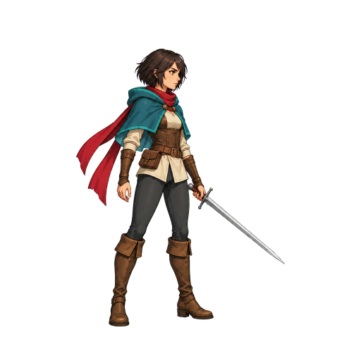
      <br />
      <strong>1. One approved master still</strong>
      <br />
      <sub>Generated by the local Codex CLI (<code>image_gen</code>), take 1 of 3.</sub>
    </td>
    <td align="center" width="70%">
      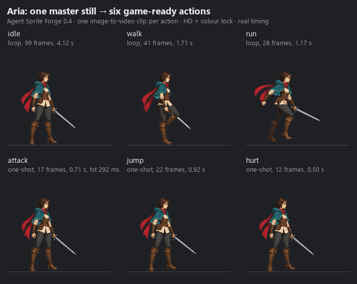
      <br />
      <strong>2. Six actions, one image-to-video clip each</strong>
      <br />
      <sub>Grok image-to-video (local CLI), soft-matte keyed, registered, loops picked by measurement, one-shots retimed to game speed, HD finish with the colour lock. Real timing.</sub>
    </td>
  </tr>
</table>

<p align="center">
  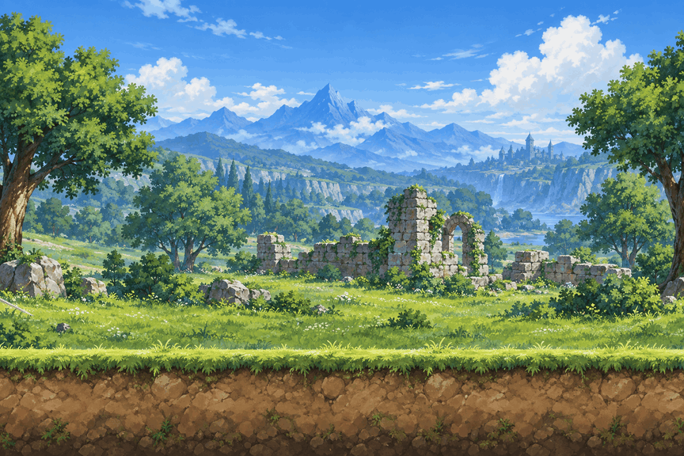
  <br />
  <em>3. In a scene: the packaged run, attack and idle over a generated background. The run speed is measured from the contact foot, so the feet do not slide. Every frame comes from the 2026-10-06 live run; nothing is mocked up.</em>
</p>

<p align="center">
  <a href="#whats-new-in-04--the-big-upgrade">What's new</a> ·
  <a href="#quickstart">Quickstart</a> ·
  <a href="#routes-and-providers">Routes and providers</a> ·
  <a href="#pipeline-master--set--finish--export">Pipeline</a> ·
  <a href="#maps">Maps</a> ·
  <a href="#showcase-games-made-with-agent-sprite-forge">Showcase</a> ·
  <a href="#tools">Tools</a>
</p>

## What's new in 0.4 — the big upgrade

Before 0.4, character animation meant cutting frames out of an image-generated sheet, or keying a single clip by hand. 0.4 turns one approved still into the whole set: one image-to-video clip per action, and a measured pipeline from every clip to the engine. Before and after, measured on real outputs:

<table>
  <tr>
    <td align="center" width="50%">
      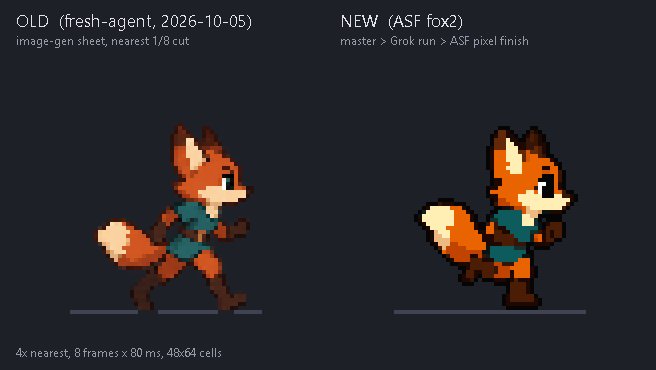
      <br />
      <strong>Pixel finish: the 48x64 fox run</strong>
      <br />
      Old: one image-gen sheet cut 1/8 (594–709 colours per frame, soft alpha). New: master still → Grok clip → pixel finish (16–19 colours, binary alpha, selective outline). 4x nearest, both at 80 ms.
    </td>
    <td align="center" width="50%">
      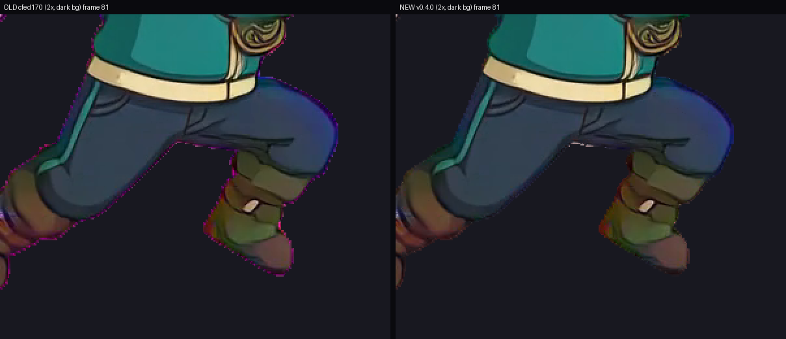
      <br />
      <strong>Soft-matte keyer: no purple fringe</strong>
      <br />
      Same Grok clip, same frame, 2x crop. Fringe 0.704 → 0, leaked key pixels 7,780 → 0, keying 271 s → 44 s for 145 frames.
    </td>
  </tr>
  <tr>
    <td align="center" width="50%">
      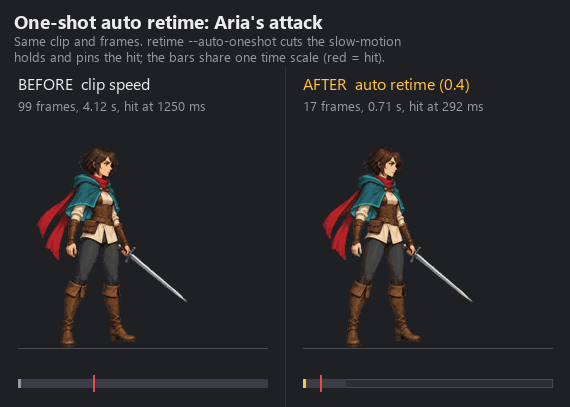
      <br />
      <strong>One-shots retimed to game speed</strong>
      <br />
      Image-to-video plays a quick attack as a slow-motion clip. <code>retime --auto-oneshot</code> cuts the frozen holds and pins the hit: 4.1 s → 0.7 s, hit at 292 ms.
    </td>
    <td align="center" width="50%">
      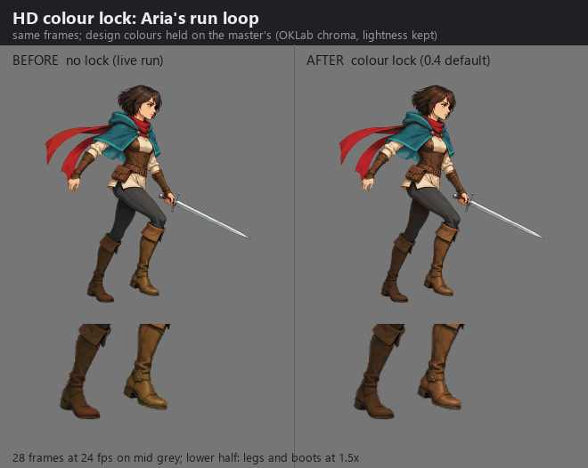
      <br />
      <strong>HD colour lock</strong>
      <br />
      Video models drift colours on fast limbs. The lock holds every design colour on the master's (OKLab chroma, lightness kept), so the boots stop shimmering.
    </td>
  </tr>
</table>

| Measured on the live runs | before | 0.4 |
|---|---:|---:|
| Pixel fox (48x64, 8 frames): colours per frame | 594–709 | **16–19** |
| Pixel fox: alpha levels | 199 | **2** |
| Pixel fox: lone pixels per frame (mean) | 732 | **75** |
| Keyer: purple fringe (outer-ring spill, mean) | 0.704 | **0** |
| Keyer: key pixels leaked over 145 frames | 7,780 | **0** |
| Keyer: time for 145 frames | 271 s | **44 s** |
| Attack: one-shot length | 4.1 s | **0.7 s** |
| Colour lock: hue flips per frame pair (run loop) | 352 | **170** |
| QC: good takes wrongly rejected | 18 of 24 | **0 of 24** |

What changed:

- **Image generation first.** Every image and clip goes through one command, `route_media.py`: your API key if you configured one (OpenAI, Google Gemini, xAI, BytePlus, fal.ai), else your signed-in Codex or Grok CLI, else code art as the last resort. See [Routes and providers](#routes-and-providers).
- **One master still per character.** `master_still.py` writes the prompt, generates takes, fixes a near-miss by edit and approves one still (`master.json`).
- **A whole set from that still.** `sprite_set.py` makes one image-to-video clip per action, gates every take (area, feet, identity, zoom, turning around, edges, background, extra objects, motion, end pose, colour bleed, timing), retakes with fix clauses, keys with a soft matte, registers, picks loops, retimes one-shots, finishes and packages.
- **HD finish by default, crisp pixel finish on request.** One body scale per character from the master. The pixel finish adds a crisp downscale, a spaced palette of at most 32 colours, a selective outline and binary alpha.
- **Colour lock** on every action of a set, and **QC recalibrated** on 42 labelled live takes.
- **Engine exports.** animation.json 3.0 with a PNG atlas, VP9-alpha WebM and packed-alpha MP4, decoded and verified; Godot SpriteFrames and Sprite3D; Aseprite JSON; maps for Tiled, Godot and LDtk.
- **Claude Code plugin**, plus Codex and Grok installs. Hardened on Windows: Codex sandbox run folders, locked-file cleanup, cp1252/cp950 consoles.

Everything in the [CHANGELOG](./CHANGELOG.md). The live record, weak points included: [docs/validation-2026-10-06.md](./docs/validation-2026-10-06.md).

## Quickstart

### 1. Install

**Claude Code (plugin)**

```bash
claude plugin marketplace add 0x0funky/agent-sprite-forge --sparse .claude-plugin skills
claude plugin install agent-sprite-forge@agent-sprite-forge
python -m pip install "numpy>=1.26" "Pillow>=10.1" "scipy>=1.11"
```

`--sparse` checks out only the plugin manifest and the skills, not the showcase media.

**Codex**

```bash
git clone https://github.com/0x0funky/agent-sprite-forge.git
cd agent-sprite-forge
python -m pip install -r requirements.txt
python tools/install_skills.py --apply --host codex
```

**Grok**: from the same clone, `python tools/install_skills.py --apply --host grok` (`~/.grok/skills`). `--host agents` writes `~/.agents/skills` and `--dest <folder>` any skills folder.

`--apply` backs up an installed copy and writes a sha256 manifest; `python tools/install_skills.py --check --host codex` reports drift later. Video needs ffmpeg 5.1+ on `PATH`. Start a new agent session so the skills load.

Optional: configure an API key ([Setting API keys](#setting-api-keys)). Without one, the agent uses your signed-in Codex or Grok CLI.

### 2. Make the master still

```text
Use $generate2dsprite to make a master still of Aria, a young swordswoman hero: short dark hair, a teal hooded cloak, a long red scarf and one steel sword. Side view, facing right, HD.
```

The agent runs `master_still.py generate --takes 3` (every take through `route_media.py`), shows you the takes, fixes a near-miss with `master_still.py edit` ("THE ONLY CHANGE: ..."), and approves one: the still is keyed, padded to the class framing (a hero stands 788 px tall on 1024x1024) and recorded in `master.json`.

<p align="center">
  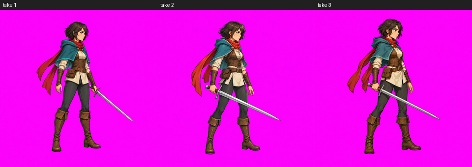
</p>

### 3. Make the sprite set

```text
Use $video2dsprite to animate the approved Aria master: idle, walk, run, attack, jump and hurt. Package them for Godot and the web.
```

Under the hood (`<skill-dir>` is the installed `video2dsprite` folder):

```bash
python "<skill-dir>/scripts/sprite_set.py" plan --master art/aria-master/master.json --output-dir art/aria-set
python "<skill-dir>/scripts/sprite_set.py" run --plan art/aria-set/set_plan.json
python "<skill-dir>/scripts/sprite_set.py" review --plan art/aria-set/set_plan.json
python "<skill-dir>/scripts/sprite_set.py" accept --plan art/aria-set/set_plan.json --action run --take 2
python "<skill-dir>/scripts/sprite_set.py" report --plan art/aria-set/set_plan.json
```

`run` resumes where it stopped and never generates a clip twice. The agent looks at every review sheet before it accepts an action, because the numbers cannot see a changed weapon or a covered face. Each action ends as a verified package; `export_engine.py` adds Godot and Aseprite files.

## Routes and providers

Every generated image or clip goes through `generate2dmedia/scripts/route_media.py`. It walks this order and names the route it used:

| Order | Route | Images | Video | Used when |
|---|---|---|---|---|
| 1 | **API**: a key you configured | OpenAI, Google Gemini, xAI, BytePlus Seedream, fal.ai (reference edits) | xAI, BytePlus Seedance, fal.ai (Kling v3, Veo 3.1, Luma, MiniMax, Wan, Vidu, LTX) | A key is configured. The key is your consent, so there is no per-call question |
| 2 | **Local CLI**: your own signed-in Codex or Grok | Codex `image_gen` (up to 8 references); Grok one-shot image or edit | Grok image-to-video in ACP mode (6 or 10 s) | No key, or every API route refused for an account reason (no key, auth, quota, rate limit). Uses your subscription quota, never an API key |
| 3 | **Code art** (`codeart2d`) | Code-drawn pixel sprites, vector art, FX, tiles | Rigged animation | The last resort: only when no route exists (`no-route`, exit 3) or when you ask for code-drawn art. Always disclosed as code-drawn |

`python "<generate2dmedia>/scripts/route_media.py" resolve --kind image` prints the route that would run, and `forge_doctor.py` lists which keys are configured (yes or no, never the key) and the resolved order. A moderation refusal, or an outcome that may have cost money, is never retried on another route.

### Supported providers

| Provider | Key variable | Images | Video | Pins the last frame | Notes |
|---|---|---|---|---|---|
| OpenAI | `OPENAI_API_KEY` | generate and edit, 16 references, native alpha | none | n/a | `gpt-image-2.5-sunburst` by default |
| Google Gemini | `GOOGLE_API_KEY` or `GEMINI_API_KEY` | generate and edit, 14 references | none | n/a | Pro model for hero masters; SynthID watermark |
| xAI | `XAI_API_KEY` | generate and edit, 5 references | 1–15 s, 480p–1080p | yes (1.5 at 480p or 720p), up to 4 keyframes | Lite model for drafts |
| BytePlus ModelArk | `ARK_API_KEY` | Seedream generate and edit, 10 references | Seedance, 4–15 s | yes | activate the models first; no real faces |
| fal.ai | `FAL_KEY` | reference edits (Nano Banana 2 and Pro, Seedream 5, GPT Image 2) | Kling v3, Veo 3.1, Luma Ray 3.2, MiniMax H3, Wan 3.0, Vidu Q3, LTX-2.5 | yes, on every curated model | Veo and LTX get the still padded to 16:9; the crop box is recorded |

Each model's limits are checked against [capabilities.json](./skills/generate2dmedia/references/capabilities.json) before anything is sent; a request the model cannot take is skipped with the reason or adapted with a note (for example a video length snapped to one the model renders). Every clip is published without audio. Details: [route-media.md](./skills/generate2dmedia/references/route-media.md), [api-usage.md](./skills/generate2dmedia/references/api-usage.md), [provider-survey.md](./skills/generate2dmedia/references/provider-survey.md), [cli-routes.md](./skills/generate2dmedia/references/cli-routes.md).

### Setting API keys

Each provider reads only its own key, from the environment or from one JSON file in your user configuration folder (never inside a project); the environment wins.

| System | Config file |
|---|---|
| Windows | `%APPDATA%\agent-sprite-forge\config.json` |
| macOS, Linux | `~/.config/agent-sprite-forge/config.json` (or `$XDG_CONFIG_HOME/agent-sprite-forge/config.json`) |

```json
{
  "OPENAI_API_KEY": "sk-...",
  "GEMINI_API_KEY": "...",
  "XAI_API_KEY": "xai-...",
  "ARK_API_KEY": "...",
  "FAL_KEY": "key-id:key-secret",
  "providers": {"order": {"image": ["gemini", "openai"], "video": ["byteplus"]}}
}
```

Every field is optional. `providers.order` puts your favourite providers first; `models` picks a model per provider and tier. Keys are read in-process only: never printed, logged, written, passed on a command line or handed to a child process, and a provider never uses another provider's key. On macOS and Linux keep the file private (`chmod 600`).

### Spend records

Every call, paid or local, is a line in `<project>/.forge/ledger.jsonl` with its estimate, the provider's job id and the artifact's sha256, and each output folder keeps a `job.json`. There is no cap unless you set one: `--budget-usd`, `--max-calls`, `FORGE_MAX_PAID_REQUESTS`, and `FORGE_SESSION_IMAGES` / `FORGE_SESSION_VIDEOS` for the local routes. `media_ledger.py summary` shows the totals.

## Pipeline: master → set → finish → export

```text
master still        one clip per action      cut                     finish                 package and export
master_still.py --> sprite_set.py run    --> gait_loop.py select --> finish_frames.py   --> engine_export.py package + verify
generate, edit,     route_media.py video,    (loops), retime.py      hd (default) or        export_engine.py (Godot, Aseprite)
approve             gates, retakes, soft     --auto-oneshot          pixel, colour lock
                    matte, registration      (one-shots)             to the master
```

| Step | Tool | What it does |
|---|---|---|
| Master | `master_still.py` | Takes through `route_media.py`, a fix by edit, then `approve`: keyed, padded to the class framing, `master.json` with the identity recap every motion prompt repeats |
| Clips | `sprite_set.py run` | One image-to-video clip per action from the master, on a per-action canvas (jump 3:4 with headroom, attack 16:9); idle and attack pin their last frame where the route can |
| Gates | `sprite_set.py` | Area, feet, identity, zoom, turning around, edges, background, extra objects, motion, end pose, colour bleed, timing; up to 3 takes with fix clauses, else the best usable window |
| Key and register | `video2dsprite.py process`, `register_clip.py` | Soft matte with one profile per character; the inverse of the recorded input transform, so the body scale never pumps |
| Cut | `gait_loop.py`, `retime.py` | Walk, run and idle loops chosen by measurement; one-shots retimed to game length with the hit pinned (attack 0.7 s, jump 0.9 s, hurt 0.5 s) |
| Finish | `finish_frames.py` | HD: one scale per character, premultiplied area downscale, clean alpha, colour lock. Pixel: crisp downscale, shared spaced palette, selective outline, binary alpha, optional fixed cells (`--canvas 48x64`) |
| Package | `engine_export.py` | animation.json 3.0, PNG atlas, WebM alpha, packed MP4, poster; `verify` decodes every file |
| Review | `sprite_set.py review`, `accept`, `report` | Contact sheets, finished strips and a cast line-up for the agent to look at; the report lists routes, takes, QC numbers, loops and timing |

### Engine exports

| Target | What you get | Tool |
|---|---|---|
| Web and any engine | `animation.json` 3.0 (whole-ms durations, events, anchor), PNG atlas, VP9-alpha WebM, packed-alpha H.264 MP4 for iPhone, poster; `forge-runtime.mjs` and a WebGL packed-alpha compositor | `engine_export.py package`, then `verify` |
| Godot 4 | SpriteFrames `.tres` with an AnimatedSprite2D `.tscn`; an AnimatedSprite3D package | `export_engine.py --target godot-spriteframes`, `godot-sprite3d` |
| Aseprite, Phaser, PixiJS | Aseprite JSON array atlas with frame tags, events and the pivot | `export_engine.py --target aseprite-json` |
| Maps | Tiled 1.10, Godot 4.3+ (TileMapLayer scene), LDtk 1.5.3 | `export_tiled.py`, `export_godot.py`, `export_ldtk.py` |

<p align="center">
  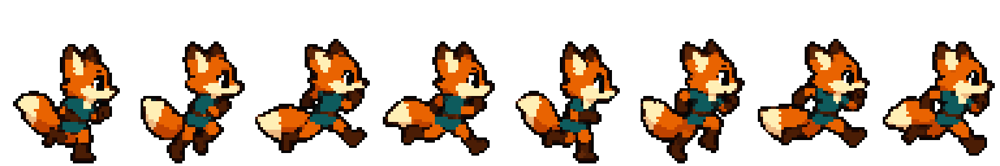
  <br />
  <em>The pixel fox as shipped: 8 frames, 48x64 cells, 80 ms each, with Godot, Aseprite and web packages (sheet shown at 4x).</em>
</p>

> **Editor imports are not verified yet.** The exporters prove parse-level round trips, and Tiled exports are re-rendered at 0 px difference; nobody has opened the 0.4.0 Godot, LDtk or Aseprite exports in the editors.

## Maps

`generate2dmap` makes maps instead of isolated sprites: painted layered maps (a ground-only base, a dressed reference, a prop pack, then anchored transparent props), tiles and autotiles, side-scroll stages and HD-2D battle plates. Collision, reachability and exits come from data (`map_bundle.v2`, `map_nav.py`), with exports to Tiled, Godot 4 and LDtk and a single-file walkable HTML preview.

<table>
  <tr>
    <td align="center" width="33%">
      
      <br />
      <strong>Ground-only base</strong>
    </td>
    <td align="center" width="33%">
      
      <br />
      <strong>Dressed reference</strong>
    </td>
    <td align="center" width="33%">
      
      <br />
      <strong>3x3 prop pack</strong>
    </td>
  </tr>
</table>

<p align="center">
  
  <br />
  <strong>The layered map: anchored props sorted on their ground lines</strong>
</p>

## Showcase: games made with Agent Sprite Forge

Original games and characters, assembled with Codex and the skills in earlier releases. They show the full loop: generated assets, structured scene data and playable prototype wiring.

<table>
  <tr>
    <td align="center" width="50%">
      
      <br />
      <strong>Summon Survivors — Unity WebGL</strong>
      <br />
      Generated map art, hero sheets, summons, evolutions, enemies, bosses, pickups, HUD, FX, level-up choices and a WebGL build.
      <br />
      <a href="https://summon-survivors.vercel.app/">Play build</a> · <a href="https://drive.google.com/file/d/1TL7qRX95przTToZILVQ1EFwEXm3flB6t/view?usp=sharing">Build conversation</a>
    </td>
    <td align="center" width="50%">
      
      <br />
      <strong>Forest Pass Defense — Godot tower defense</strong>
      <br />
      A Godot 4 prototype with map, separated props, tower slots, towers, enemy sheets, boss and flying enemies, waves, HUD, build/upgrade/sell flow, projectiles and targeting rules.
    </td>
  </tr>
  <tr>
    <td align="center" width="50%">
      
      <br />
      <strong>Editable RPG map — Godot TileMap</strong>
      <br />
      An image-generated tileset and prop sheet wired into editable <code>TileMapLayer</code>, <code>Sprite2D</code> props, encounter grass <code>Area2D</code>, <code>StaticBody2D</code> collision, exits, metadata and a debug player and camera.
    </td>
    <td align="center" width="50%">
      
      <br />
      <strong>Neon Breach — cyberpunk side-scroller</strong>
      <br />
      A playable side-scroller prototype built around generated character, attack, map and gameplay assets.
    </td>
  </tr>
  <tr>
    <td align="center" width="50%">
      
      <br />
      <strong>Sengoku Era — JavaScript monster RPG</strong>
      <br />
      A browser RPG prototype with generated characters, starter selection, map flow and battle UI.
      <br />
      <a href="https://sengoku-era.vercel.app/">Play build</a>
    </td>
    <td align="center" width="50%">
      
      <br />
      <strong>Starter selection and battle loop</strong>
      <br />
      A compact JavaScript game built from sprite, monster, battle and map assets made with the skills.
    </td>
  </tr>
</table>

<details>
<summary>More Godot tower-defense output</summary>

<table>
  <tr>
    <td align="center" width="40%">
      
      <br />
      <strong>Enemy roster, including flyer and boss units</strong>
    </td>
    <td align="center" width="30%">
      
      <br />
      <strong>Tower lineup</strong>
    </td>
    <td align="center" width="30%">
      
      <br />
      <strong>HUD and gameplay icons</strong>
    </td>
  </tr>
</table>

- `scenes/ForestPass.tscn` with base map, separated props, enemy paths, tower slots and HUD nodes.
- Six tower families with generated tower art and upgrade stages.
- Animated enemy sheets for ground units, flying units and boss encounters.
- Wave, difficulty, tower catalog, collision, route and tower-slot metadata.
- Runtime build, upgrade, sell, projectile and targeting behaviour connected in Godot.

</details>

<details>
<summary>More Unity survivors-like output</summary>

<table>
  <tr>
    <td align="center" width="50%">
      
      <br />
      <strong>Summons, enemies, pickups, HUD and objective flow</strong>
    </td>
    <td align="center" width="50%">
      
      <br />
      <strong>Level-up choices: summon unlocks, training, stats and recovery</strong>
    </td>
  </tr>
</table>

- `Assets/Survivors/Scenes/SummonSurvivors.unity` as the playable scene.
- `SurvivorContentDatabase.asset` connecting generated hero, summon, enemy, pickup, HUD and FX sprites.
- Starter summon selection, survival objective, XP and coin pickups, level-up choices, summon training and evolution flow.
- Enemy spawning pressure, boss timing, projectile attacks, area damage, health bars and score tracking.
- WebGL build output under `Builds/WebGL` with Vercel deployment config.

</details>

<details>
<summary>Godot editable TileMap: the meadow layers</summary>

<table>
  <tr>
    <td align="center" width="50%">
      
      <br />
      <strong>Layered map preview</strong>
    </td>
    <td align="center" width="50%">
      
      <br />
      <strong>Collision and zone debug overlay</strong>
    </td>
  </tr>
  <tr>
    <td align="center" width="50%">
      
      <br />
      <strong>Image-generated tileset atlas</strong>
    </td>
    <td align="center" width="50%">
      
      <br />
      <strong>3x3 generated prop pack</strong>
    </td>
  </tr>
</table>

</details>

### FX and sheet sprites

Sheets stay the route for FX, icons and props: casts, projectiles and impacts come from `$generate2dsprite` sheets.

<table>
  <tr>
    <td align="center" width="50%">
      
      <br />
      <strong>Spell cast</strong>
    </td>
    <td align="center" width="50%">
      
      <br />
      <strong>Projectile</strong>
    </td>
  </tr>
</table>

<details>
<summary>Earlier character output (0.3): four-direction walk sheets and the Ryo video case study</summary>

Characters were cut from image-generated sheets before 0.4; 0.4 animates them from one master still instead.

<table>
  <tr>
    <td align="center" width="25%"><br /><strong>Down</strong></td>
    <td align="center" width="25%"><br /><strong>Left</strong></td>
    <td align="center" width="25%"><br /><strong>Right</strong></td>
    <td align="center" width="25%"><br /><strong>Up</strong></td>
  </tr>
</table>

The 0.3 video pipeline on Ryo (base still → 6 s image-to-video → chroma key → 16-frame strip); the 0.4 keyer's numbers on this clip are in the [CHANGELOG](./CHANGELOG.md).

| Base still | Motion (image-to-video) | Sprite result (16 frames) |
| --- | --- | --- |
| 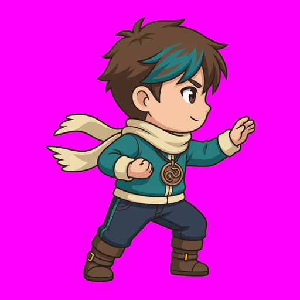 | 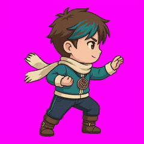<br />[Download MP4](./src/video2dsprite-ryo/run-6s.mp4) | 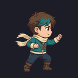 |

<p align="center">
  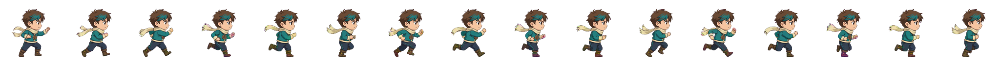
  <br />
  Short skill intro (MP4): <a href="./src/video2dsprite-ryo/intro.mp4">intro.mp4</a>
</p>

</details>

### Code art: the last-resort fallback

When no image route exists, or when you ask for code-drawn art, `codeart2d` draws it from a spec with no image model and no quota, and says so. These are rendered from [`skills/codeart2d/examples`](./skills/codeart2d/examples).

<table>
  <tr>
    <td align="center" width="25%">
      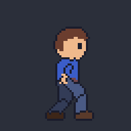
      <br />
      <sub><code>rig_animate.py</code>: FK/IK walk with planted feet</sub>
    </td>
    <td align="center" width="45%">
      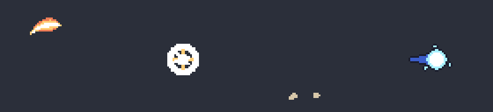
      <br />
      <sub><code>fx_build.py</code>: slash, impact, dust and projectile with hit events</sub>
    </td>
    <td align="center" width="30%">
      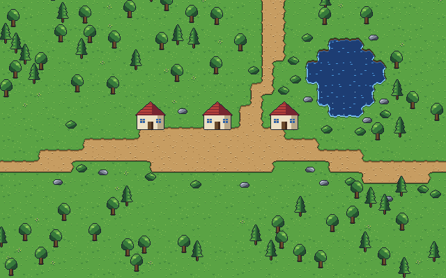
      <br />
      <sub><code>autotile_build.py</code> + <code>layout_build.py</code>: seam-proven tiles, every exit reachable</sub>
    </td>
  </tr>
</table>

## Included skills

Keep the five skill folders together: they call each other's scripts by relative path.

| Skill | Use it for | Main outputs |
| --- | --- | --- |
| [`generate2dsprite`](./skills/generate2dsprite) | Master stills, characters, creatures, props, icons and FX; sheets for FX, icons and props; packaging frames from any source | `master.json`, registered frames, clips with ticks and events, palettes, QA, Aseprite/Godot exports |
| [`video2dsprite`](./skills/video2dsprite) | A whole sprite set from one master still (`sprite_set.py`), or one supplied clip | Gated, soft-keyed, registered, looped or retimed, finished frames; animation.json 3.0, WebM alpha, packed MP4, PNG fallback |
| [`generate2dmap`](./skills/generate2dmap) | Top-down and side-scroll maps, tiles, prop kits, parallax, HD-2D plates | map_bundle.v2, collision and navigation checks, Tiled/Godot/LDtk exports, HTML preview, scene loops |
| [`generate2dmedia`](./skills/generate2dmedia) | The route to every generated image and clip (`route_media.py`), the five API providers, the local Codex/Grok CLI routes, the capability check | Media with receipts, ledger lines, route proofs |
| [`codeart2d`](./skills/codeart2d) | Code-drawn pixel sprites, flat vector art, FX, autotiles, layouts, parallax: the last resort, or on request | Exact-palette frames, clips, fx.v1 runtime, seam-proven tilesets, playable bundles, `codeart-meta.json` |

In Codex, `codeart2d` and `generate2dmedia` are explicit-only: the sprite, video and map skills route to them.

## Tools

Run from your project root as `python "<skill-dir>/scripts/<tool>.py" ...`. Every tool has `--help`, writes a new output folder (it never replaces one), prints one JSON line and exits 1 on failure. The SKILL.md files hold the routing tables.

| Skill | Tool | What it does |
| --- | --- | --- |
| generate2dsprite | `master_still.py` | `prompt`, `generate --takes N`, `edit`, `pad`, `approve`: one approved master still per character, `master.json` |
| | `generate2dsprite.py process` | Keys (soft or hard), slices and registers a sheet on one sampling grid; pipeline-meta v2 with QA |
| | `sheet_qc.py` | `spill` finds parts crossing cell lines before slicing; `frames` checks identity, NEAR/FAR leg alternation, drift |
| | `scale_frames.py` | One scale and root per action; the canvas grows, nothing is clamped |
| | `plan_guide.py`, `make_anchor_layout.py`, `make_layout_guide.py` | Sheet planning, pose guides and fixed-scale templates for an image tool |
| | `build_animation_clips.py` | Clips v2: 60 Hz ticks, events, transitions, hit-stop, review sheets and lints |
| | `assemble_frames.py` | Packs whole frames losslessly; ownership slicing, loop seams, ambient crossfades |
| | `palette_tool.py`, `pixel_reduce.py` | OKLab palettes, locks, variants, flicker-free clip quantizing; integer pixel-grid reduction |
| | `export_engine.py` | Aseprite JSON, Godot SpriteFrames and AnimatedSprite3D (imports not yet verified) |
| video2dsprite | `sprite_set.py` | `plan`, `run`, `review`, `accept`, `retake`, `report`: one clip per action from one master, gates, retakes, finish and packages |
| | `finish_frames.py`, `colour_lock.py` | HD (default) or pixel finish, shared palettes, cast line-up; colour lock to the master and its measurement |
| | `video2dsprite.py` | `key-plan`, `triage`, soft-matte `process`/`clean`, `package`, `verify`, `doctor` |
| | `prepare_i2v_input.py`, `register_clip.py` | Registration by construction: input on a recorded transform, one inverse transform back, take QC |
| | `gait_loop.py`, `retime.py`, `animation_review.py` | Measured walk/run/idle loops and stride; one-shot auto retime and impact/hold timing on ticks; classified candidates |
| | `engine_export.py`, `validate_animation.py` | animation.json 3.0 with WebM alpha, packed MP4 and mobile tiers behind a residue gate; decoded verify; contract check |
| | `references/runtime/forge-runtime.mjs`, `packed-alpha-webgl.mjs` | Distance-driven walks, hit-stop, transitions; WebGL packed-alpha compositor |
| generate2dmap | `extract_prop_pack.py` | Anchored transparent props with footprints and despill (prop_pack.v2) |
| | `extract_terrain_tiles.py`, `extract_platform_strip.py` | Terrain fills, overlays, iso/hex and Wang rows; platform caps with surface and seam QC |
| | `compose_layered_preview.py`, `validate_parallax.py`, `conform_background.py` | Ground-line sorted previews with audit overlays; parallax coverage and seams; fitting paintings to screens |
| | `map_bundle.py`, `map_nav.py` | map_bundle.v2 validation; collision, reachability and portals from data |
| | `export_tiled.py`, `export_godot.py`, `export_ldtk.py` | Tiled 1.10 (re-render verified), Godot 4.3+ and LDtk 1.5.3 (parse level only) |
| | `validate_chunks.py`, `validate_layout.py` | Room-chunk sockets; side-scroll jumps, slopes and decks |
| | `build_scene_preview.py`, `references/runtime/map-runtime.mjs` | Single-file walkable HTML preview with a route check; JS collision that mirrors map_nav |
| | `scene_layout_guide.py`, `validate_stage.py`, `extract_scene_lights.py`, `edit_locality_check.py` | HD-2D stage guide, aspect-robust battle layout, lights and atmosphere, variant locality |
| | `build_motion_mask.py`, `scene_motion.py` | Masked motion on a still plate; GOP-aligned loops with decoded-seam QA |
| generate2dmedia | `route_media.py` | `image`, `video`, `resolve`: API key first, then the local CLIs, then `no-route` |
| | `media_providers.py` | The five API adapters (OpenAI, Gemini, xAI, BytePlus, fal.ai) behind one interface; `list` prints the models |
| | `forge_doctor.py` | Capability check, configured keys (yes/no) and the route order; `--verify-route` |
| | `cli_media.py` | Local Codex/Grok CLI image, edit and video routes; `resume`, `adopt --codex-thread`, `batch` |
| | `generate_media.py`, `media_ledger.py` | One paid API call with a dry run, caps and receipts; ledger summary and settle |
| codeart2d | `render_pixelspec.py`, `pixel_qa.py` | PixelSpec to exact-palette frames and clips; pixel-art QA |
| | `svg_render.py`, `rig_animate.py` | Portable SVG `render`, `lint` and renderer `doctor`; SVG rigs with FK, two-bone IK and a ground constraint |
| | `fx_build.py`, `fx_verify.mjs` | Six FX presets with hit events and the fx.v1 runtime; runtime checker |
| | `autotile_build.py`, `layout_build.py`, `parallax_build.py`, `ambient_bake.py` | Seam-proven tilesets; playable top-down layouts; periodic parallax layers; ambient loops on a plate |
| repository | `tools/install_skills.py`, `tools/vendor_sync.py`, `tools/check_links.py` | Guarded install and drift check; shared-module copies in sync; README/doc link check |

## Requirements

| Need | Install |
| --- | --- |
| Every skill | Python 3.10+, `python -m pip install -r requirements.txt` (numpy>=1.26, Pillow>=10.1, scipy>=1.11; scipy is an accelerator with an identical numpy fallback) |
| Video, sprite sets, packaging and scene loops | ffmpeg 5.1+ with libvpx-vp9 and libx264 on `PATH` |
| Image and video generation (one of) | An API key for OpenAI, Gemini, xAI, BytePlus or fal.ai ([Setting API keys](#setting-api-keys)), or your own signed-in Codex CLI or Grok CLI |
| codeart2d SVG art | `python -m pip install -r requirements-codeart.txt` (resvg-py>=0.5,<0.6), or the resvg-js CLI, or Chrome/Edge. PixelSpec sprites need nothing extra |
| JS runtimes, `fx_verify.mjs`, scene preview checks | node 22 (optional); `build_scene_preview.py --verify` also uses playwright when present |
| Contributors | `python -m pip install -r requirements-dev.txt`, then `python -m pytest -q` and `node --test "tests/js/*.test.mjs"` |

## Suggested prompts

### A character, start to finish

```text
Use $generate2dsprite to make a master still of a fox ranger for a 2D platformer: orange fur, teal tunic, brown boots, side view facing right. Show me three takes.
```

```text
Use $video2dsprite to turn the approved fox master into idle, run, attack and hurt, pixel finish in 48x64 cells at 80 ms, and export it for Godot and Aseprite.
```

### Sprites and FX

```text
Use $generate2dsprite to create a wizard spell bundle with cast, projectile and impact sprites.
```

```text
Use $video2dsprite with my existing side-view hero PNG as the master. Make a run loop and an attack, and report the routes and QC numbers.
```

### Maps

```text
Use $generate2dmap to create a small top-down village with a pond, roads to three exits, collision and a walkable HTML preview, then export it to Tiled.
```

```text
Use $generate2dmap to create an HD-2D battle plate for a harbour at night with lantern lights and moving water.
```

<details>
<summary>Whole-game prompts used for the showcase prototypes</summary>

```text
use $generate2dsprite to create a 2D side-scrolling action game. It should include attack mechanics, map elements, and all the essential features. I would like you to design it, and all the necessary assets should be created using this skill. It needs to be an actually playable game, with a cyberpunk story setting.
```

```text
Use $generate2dsprite to create a 2D monster-collecting RPG. You only need to build one scene for now. It must include a starter monster selection mechanic, a battle screen, and all basic gameplay functions. I would like you to design all the elements and the story, and you can also decide which game engine to use. Use this skill to create any assets you need. The story should be set in the Sengoku period.
```

</details>

## Notes and limits

- The scripts are not the creative brain, and numeric QA never approves anatomy or motion by itself: the agent looks at the review sheets, and you approve the master.
- Image-to-video models drift on fast limbs and jumps. Expect retakes on run and jump; the gates and fix clauses exist for that, and the live record shows how many it took.
- What is and is not proven is in [docs/known-limitations.md](./docs/known-limitations.md); live results are in [docs/validation-2026-10-06.md](./docs/validation-2026-10-06.md).
- Engine and editor imports of the 0.4.0 exporters are not verified yet (see [Engine exports](#engine-exports)).

## Generated assets and licensing

The MIT license below covers this repository's code and documentation. It does not cover what you generate with it. Images and videos from an image or video model are subject to that provider's terms; code-drawn art is produced from specs you or your agent write. Do not trace or prompt for characters or people you do not own. For commercial projects, use original characters or IP you control, and check each provider's terms.

## Repository layout

```text
agent-sprite-forge/
  .claude-plugin/        plugin.json, marketplace.json (Claude Code)
  skills/
    generate2dsprite/    SKILL.md, agents/openai.yaml, references/, scripts/
    video2dsprite/
    generate2dmap/
    generate2dmedia/
    codeart2d/           examples/ with every spec shown above
  shared/                canonical shared modules and JSON schemas (vendored into skills)
  tools/                 install_skills.py, vendor_sync.py, check_links.py
  tests/                 pytest and node suites, fixtures with provenance
  docs/                  validation records, known limitations, audit
  src/                   README media (src/v040: the 0.4 showcase)
  CHANGELOG.md
```

## Star history

<a href="https://www.star-history.com/?repos=0x0funky%2Fagent-sprite-forge&type=date&legend=top-left">
 <picture>
   <source media="(prefers-color-scheme: dark)" srcset="https://api.star-history.com/chart?repos=0x0funky/agent-sprite-forge&type=date&theme=dark&legend=top-left" />
   <source media="(prefers-color-scheme: light)" srcset="https://api.star-history.com/chart?repos=0x0funky/agent-sprite-forge&type=date&legend=top-left" />
   
 </picture>
</a>

## License

MIT. See [LICENSE](./LICENSE).
