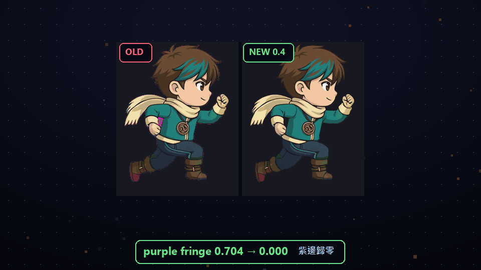
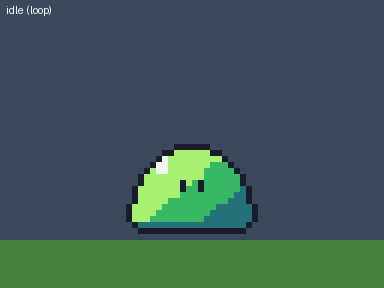
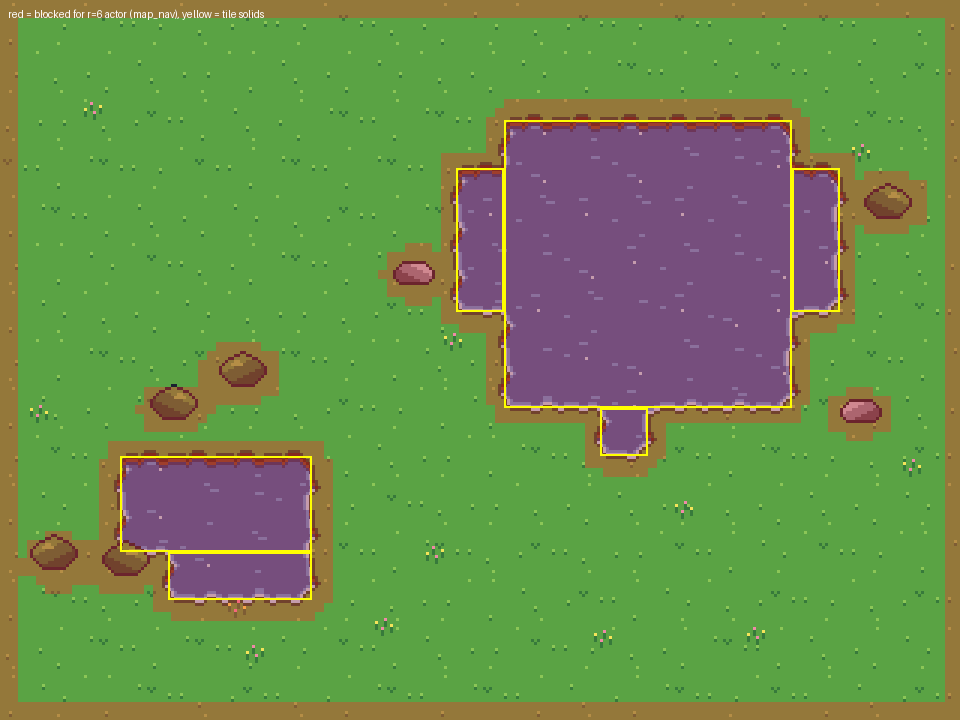
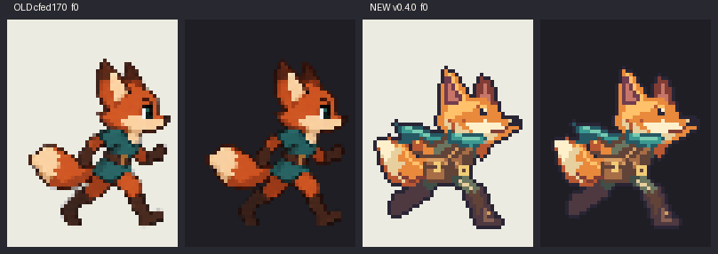
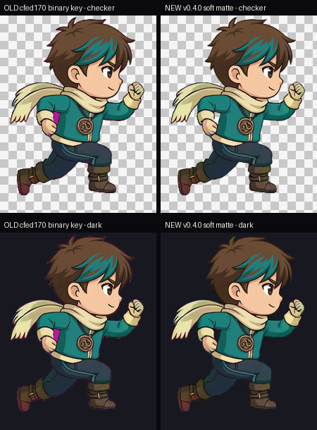

# Agent Sprite Forge

語言：[English](./README.md) | [繁體中文](./README.zh-TW.md) | [简体中文](./README.zh-CN.md) | [日本語](./README.ja.md) | [한국어](./README.ko.md)

<p align="center">
  
</p>

<p align="center">
  <strong>給 agent 使用的 2D 遊戲資產 skills：可進遊戲的 sprite、程式繪製的像素美術、AI 影片動畫與可玩地圖。</strong>
</p>

<p align="center">
  在 Codex、Claude Code 或 Grok 裡用自然語言下需求。Agent 規劃資產，從手上最合適的來源取得美術（code art、host 的生圖工具、你本機的 Codex／Grok CLI，或經你同意的付費 API），再由 deterministic Python 工具去背、切格、對位、檢查，並匯出給 Godot、Tiled、LDtk、Aseprite 或網頁遊戲。
</p>

<p align="center">
  <a href="#040-新功能">新功能</a> ·
  <a href="#showcase">Showcase</a> ·
  <a href="#包含的-skills">Skills</a> ·
  <a href="#安裝方式">安裝</a> ·
  <a href="#工具">工具</a> ·
  <a href="#建議-prompt">Prompt</a>
</p>

<p align="center">
  
  <br />
  <em>0.4.0 預告：每一幀都來自實機驗證的真實輸出，不是示意圖。</em>
</p>

## 0.4.0 新功能

這是一次整合發布；完整清單（含每個 breaking default 與對應的 legacy 開關）見 [CHANGELOG](./CHANGELOG.md)。

- **五個並列 skills。** `generate2dsprite`、`generate2dmap`、`video2dsprite`、`generate2dmedia`，以及新的 **`codeart2d`**：不用生圖模型，直接用程式畫遊戲美術。
- **Claude Code plugin。** 用 `claude plugin marketplace add` 安裝五個 skills（見下方）。Codex 與 Grok 維持資料夾安裝，現在有備份與 drift 檢查。
- **本機 agent 優先。** 圖片依序來自 host 自己的工具（Codex `image_gen`）、你本機的 Codex CLI、Grok CLI（one-shot 圖片模式）；影片來自 ACP 模式的 Grok CLI。本機路徑必須先由 `forge_doctor` 針對已安裝版本標記為 VERIFIED 才會使用。每次呼叫都寫入專案 ledger，並有 session 上限（預設每 12 小時 8 張圖、2 支影片）。付費 OpenAI／xAI API 只在你逐次同意後執行，有預算上限與重複請求防護。
- **Soft matte，沒有紫邊。** 共用 keyer：soft matte、封閉色洞移除、自動 despill、時間軸 hysteresis。在 Ryo 測試片上：每幀可見紫邊 8,504 → 0 px；145 幀中有封閉色洞的幀 16 → 0；matte 閃爍每對幀 9.6 → 3.5 次。
- **用量測挑循環。** `gait_loop.py` 找走路／跑步週期（半週期防呆、不可用幀、漂移）與 idle 循環；`retime.py` 依 impact 與 hold 在 60 Hz tick 格上重新計時攻擊動作。
- **建構式對位（registration by construction）。** `prepare_i2v_input.py` 以記錄下來的轉換把原畫放上供應商畫布；`register_clip.py` 精確反推同一個轉換，身體尺度不再逐幀忽大忽小。
- **Engine export 3.0 與 runtime。** `engine_export.py` 輸出 animation.json 3.0、PNG atlas、VP9-alpha WebM 與給 iPhone 的 packed-alpha MP4，前面有 key 殘留閘門，`verify` 會解碼每個檔案檢查。`export_engine.py` 輸出 Aseprite JSON 與 Godot SpriteFrames／Sprite3D。`forge-runtime.mjs` 提供依移動距離驅動的走路、hit-stop 與轉場；WebGL compositor 播放 packed alpha。
- **可玩地圖。** `map_bundle.v2`、`map_nav.py`（由資料推導碰撞與可達性、傳送點），匯出 Tiled、Godot 4、LDtk，並有可走動的單檔 HTML 預覽。
- **HD-2D。** `stage.v1` 搭配在 4:3 到 9:19.5 間求解的戰鬥站位、光源與氛圍擷取、場景變體的局部修改檢查，以及遮罩式場景動態與解碼後檔案的循環 QA。
- **Code-art pipeline。** PixelSpec sprite 與調色盤變體、可攜 SVG 與渲染器 doctor、FK/IK 且腳不滑步的骨架動畫、附 JS runtime 的 FX、經 seam 證明的 autotile（Wang-16、三材質、blob-47）、含可達性檢查的地圖 layout、視差與環境動態。
- **`forge_doctor.py`。** 每個 session 一次的能力檢查：套件、ffmpeg、主控台編碼、安裝 drift、API key（只看是否存在）與 Codex／Grok 就緒階梯。不讀任何憑證、不花任何額度。

## 這個 repo 解決什麼

Agent Sprite Forge 不是一包 prompt。Agent 決定規劃與美術來源；deterministic scripts 把美術變成可重用的遊戲素材，並盡可能用數字證明品質。

<table>
  <tr>
    <td width="25%">
      <strong>Sprite 與動畫</strong><br />
      角色、怪物、道具、攻擊、法術、投射物、命中、idle 與走路；來源可以是 sheet、程式或影片。
    </td>
    <td width="25%">
      <strong>地圖與場景</strong><br />
      Tiles 與 autotiles、prop pack、分層與 HD-2D 場景、碰撞、導航、出口與可走動預覽。
    </td>
    <td width="25%">
      <strong>交給引擎</strong><br />
      Aseprite JSON、Godot SpriteFrames／Sprite3D／TileMapLayer、Tiled、LDtk、animation.json 搭配 WebM 與 packed MP4、JS runtime。
    </td>
    <td width="25%">
      <strong>可量測的後處理</strong><br />
      Soft chroma key、切格、對位、調色盤、循環挑選、QA 報告與 review sheet。
    </td>
  </tr>
</table>

## Showcase

### Code Art（不用生圖模型）

由 `codeart2d` 工具依 [`skills/codeart2d/examples`](./skills/codeart2d/examples) 的 spec 算繪。程式繪製、不用生圖模型、不耗額度。

<table>
  <tr>
    <td align="center" width="25%">
      
      <br />
      <strong>骨架走路，腳步踩實</strong>
      <br />
      <code>rig_animate.py</code>：FK/IK 加地面約束，腳滑 0 px，調色盤精確。
    </td>
    <td align="center" width="45%">
      
      <br />
      <strong>FX 組</strong>
      <br />
      <code>fx_build.py</code>：斬擊、命中、塵土與投射物，含 hit 事件與 fx.v1 JS runtime。
    </td>
    <td align="center" width="30%">
      
      <br />
      <strong>可玩 layout</strong>
      <br />
      <code>autotile_build.py</code> + <code>layout_build.py</code>：seam 證明過的 tiles、碰撞，所有出口皆可到達。
    </td>
  </tr>
</table>

### 實機測試（2026-10-06）

全新、沒有對話記錄的 session，只給 skill 和一句一般需求。完整數據見 [docs/validation-2026-10-06.md](./docs/validation-2026-10-06.md)。

<table>
  <tr>
    <td align="center" width="50%">
      
      
      <br />
      <strong>Claude Code + plugin，一句中文指令</strong>
      <br />
      32x32 史萊姆（待機、跳躍、受擊）、受擊特效，加一張有碰撞的 16x16 tile 地圖，3 分鐘完成（US$1.32）。圖是程式碼畫的，也會明確標示。<code>map_bundle validate</code> 通過，所有出生點和出口都走得到。
    </td>
    <td align="center" width="50%">
      
      <br />
      <strong>Codex：和 2026-10-05 冷啟動測試同一個狐狸跑步需求</strong>
      <br />
      48 px 的像素角色現在會走 <code>codeart2d</code>。跨格溢出、半透明雜點和雜色全部歸零，不需要手動修正，還附上 Aseprite 和 Godot 匯出。取捨是：左邊舊版用生圖模型做的狐狸，動作比較生動。
    </td>
  </tr>
</table>

### Engine-Ready Prototypes

以下範例是用 Codex 搭配 `agent-sprite-forge` workflow 組出來的，展示完整閉環：生成素材、結構化場景資料與可玩的 prototype wiring。

<table>
  <tr>
    <td align="center" width="50%">
      
      <br />
      <strong>Summon Survivors — Unity WebGL</strong>
      <br />
      生成的地圖、英雄 sheet、召喚獸、進化、敵人、Boss、掉落物、HUD、FX、升級選項與 WebGL 部署。
      <br />
      <a href="https://summon-survivors.vercel.app/">遊玩</a> · <a href="https://drive.google.com/file/d/1TL7qRX95przTToZILVQ1EFwEXm3flB6t/view?usp=sharing">製作對話</a>
    </td>
    <td align="center" width="50%">
      
      <br />
      <strong>Forest Pass Defense — Godot 塔防</strong>
      <br />
      Godot 4 prototype：地圖、分離 props、塔位、塔、敵人 sheet、Boss／飛行敵人、波次、HUD、建造／升級／出售、投射物與索敵。
    </td>
  </tr>
  <tr>
    <td align="center" width="50%">
      
      <br />
      <strong>可編輯 RPG 地圖 — Godot TileMap</strong>
      <br />
      生成的 tileset 與 prop sheet 接成可編輯的 <code>TileMapLayer</code>、<code>Sprite2D</code> props、遇怪草叢 <code>Area2D</code>、<code>StaticBody2D</code> 碰撞、出口、metadata 與 debug 玩家／鏡頭。
    </td>
    <td align="center" width="50%">
      
      <br />
      <strong>Neon Breach — 賽博龐克橫向卷軸</strong>
      <br />
      以生成的角色、攻擊、地圖與遊戲素材做成的可玩橫向卷軸 prototype。
    </td>
  </tr>
  <tr>
    <td align="center" width="50%">
      
      <br />
      <strong>Sengoku Era — JavaScript 怪獸 RPG</strong>
      <br />
      瀏覽器 RPG prototype：生成角色、御三家選擇、地圖流程與戰鬥 UI。
      <br />
      <a href="https://sengoku-era.vercel.app/">遊玩</a>
    </td>
    <td align="center" width="50%">
      
      <br />
      <strong>選擇夥伴與戰鬥循環</strong>
      <br />
      由 skill workflow 生成的 sprite、怪獸、戰鬥與地圖素材組成的小型 JavaScript 遊戲。
    </td>
  </tr>
</table>

<details>
<summary>更多 Godot 塔防產出</summary>

<table>
  <tr>
    <td align="center" width="40%">
      
      <br />
      <strong>敵人陣容，含飛行與 Boss 單位</strong>
    </td>
    <td align="center" width="30%">
      
      <br />
      <strong>塔種</strong>
    </td>
    <td align="center" width="30%">
      
      <br />
      <strong>HUD 與遊戲圖示</strong>
    </td>
  </tr>
</table>

Godot prototype 產出包含：

- `scenes/ForestPass.tscn`：底圖、分離 props、敵人路徑、塔位與 HUD 節點。
- 六種塔系，含生成的塔美術與升級階段。
- 地面、飛行與 Boss 敵人的動畫 sheet。
- 波次、難度、塔目錄、碰撞、路線與塔位 metadata。
- 在 Godot 中接好的建造、升級、出售、投射物與索敵行為。

```text
image_gen map + separated props + tower sheets + enemy animation sheets + HUD icons + Godot gameplay wiring
```

</details>

<details>
<summary>更多 Unity survivors-like 產出</summary>

<table>
  <tr>
    <td align="center" width="50%">
      
      <br />
      <strong>Unity WebGL：召喚獸、敵人、掉落物、HUD 與目標流程</strong>
    </td>
    <td align="center" width="50%">
      
      <br />
      <strong>升級選項：解鎖召喚、訓練、屬性與恢復</strong>
    </td>
  </tr>
</table>

Unity prototype 產出包含：

- 可玩場景 `Assets/Survivors/Scenes/SummonSurvivors.unity`。
- `SurvivorContentDatabase.asset` 串起生成的英雄、召喚獸、敵人、掉落物、HUD 與 FX sprites。
- 選擇初始召喚獸、生存目標、經驗／金幣、升級選項、召喚訓練與進化流程。
- 敵人生成壓力、Boss 時機、投射攻擊、範圍傷害、血條與計分。
- `Builds/WebGL` 下的 WebGL 輸出與 Vercel 部署設定。

```text
image_gen map + directional hero sheets + summon/evolution sheets + enemy sheets + FX/HUD icons + Unity runtime + WebGL deploy
```

</details>

### Sprite Sheets 與 FX

需要動畫單位、可操作角色、怪物、道具、法術組、投射物／命中 FX 或依參考圖的變體時，用 `$generate2dsprite`。小型像素 sprite（可見高度 48 px 以下）與遊戲 FX 優先由 `codeart2d` 繪製。

<table>
  <tr>
    <td align="center" width="50%">
      
      <br />
      <strong>施法</strong>
      <br />
      適合打包成 bundle 的施法動畫。
    </td>
    <td align="center" width="50%">
      
      <br />
      <strong>投射物</strong>
      <br />
      搭配的投射物／命中流程。
    </td>
  </tr>
</table>

<table>
  <tr>
    <td align="center" width="25%">
      
      <br />
      <strong>下</strong>
    </td>
    <td align="center" width="25%">
      
      <br />
      <strong>左</strong>
    </td>
    <td align="center" width="25%">
      
      <br />
      <strong>右</strong>
    </td>
    <td align="center" width="25%">
      
      <br />
      <strong>上</strong>
    </td>
  </tr>
</table>

<table>
  <tr>
    <td align="center" width="35%">
      
      <br />
      <strong>參考圖</strong>
    </td>
    <td align="center" width="65%">
      
      <br />
      <strong>依參考圖生成的 sprite 動畫</strong>
    </td>
  </tr>
  <tr>
    <td align="center" width="35%">
      
      <br />
      <strong>參考圖</strong>
    </td>
    <td align="center" width="65%">
      
      <br />
      <strong>依參考圖生成的角色動作</strong>
    </td>
  </tr>
</table>

<details>
<summary>同人能力測試（不可商用）</summary>

<table>
  <tr>
    <td align="center" width="50%">
      
      <br />
      <strong>文字 → sprite</strong>
      <br />
      用一句白話需求產生攻擊動畫。
    </td>
    <td align="center" width="50%">
      
      <br />
      <strong>角色動作</strong>
      <br />
      精簡的 2D 動作 sheet，輸出透明背景。
    </td>
  </tr>
</table>

</details>

### 分層 RPG 地圖 Pipeline

要地圖而不是單一 sprite 時，用 `$generate2dmap`。手繪風分層地圖的順序：先只有地面的底圖，再來 dressed reference，再來 prop pack，接著抽出有錨點的透明 props（prop_pack.v2），最後依地面線排序合成預覽。

<table>
  <tr>
    <td align="center" width="33%">
      
      <br />
      <strong>只有地面的底圖</strong>
    </td>
    <td align="center" width="33%">
      
      <br />
      <strong>Dressed reference</strong>
    </td>
    <td align="center" width="33%">
      
      <br />
      <strong>3x3 prop pack</strong>
    </td>
  </tr>
</table>

<p align="center">
  
  <br />
  <strong>合成後的分層 RPG 地圖預覽</strong>
</p>

```text
layered_raster + y_sorted_props + precise_shapes + trigger_zones + raw_canvas
```

### Godot 可編輯 TileMap

較早的 showcase：生成的 tileset 與 3x3 prop sheet，由 agent 在遊戲專案中接成 Godot 4.5 場景。

<p align="center">
  
  <br />
  <strong>Godot editor 場景：可編輯圖層、props、區域、碰撞、出口與 debug 玩家</strong>
</p>

<table>
  <tr>
    <td align="center" width="50%">
      
      <br />
      <strong>分層地圖預覽</strong>
    </td>
    <td align="center" width="50%">
      
      <br />
      <strong>碰撞與區域 debug overlay</strong>
    </td>
  </tr>
  <tr>
    <td align="center" width="50%">
      
      <br />
      <strong>生成的 tileset atlas</strong>
    </td>
    <td align="center" width="50%">
      
      <br />
      <strong>生成的 3x3 prop pack</strong>
    </td>
  </tr>
</table>

> **引擎匯入：尚未驗證。** 0.4.0 的地圖資料可匯出到 Tiled（以重新算繪匯出檔、0 px 差異驗證），並透過 `export_godot.py`、`export_ldtk.py` 匯出到 Godot 4.3+ 與 LDtk 1.5.3；這兩者只在解析層級驗證過。`export_engine.py`（Aseprite、Godot SpriteFrames／Sprite3D）也一樣。0.4.0 的匯出檔還沒有人在編輯器中實際開過。

### 圖片 → AI 影片 → 可用的遊戲動畫

`video2dsprite` 的動作來源：host 的圖生影片工具、ACP 模式的 Grok CLI（VERIFIED 之後）、經你同意的 xAI API，或你已有的影片。核准一張原畫，以記錄下來的轉換準備輸入，用固定鏡頭生成單一動作，再去背、對位、挑循環或重新計時、封裝並驗證。精準的像素動畫仍建議用 sheet；影片不保證比較小、比較省解碼或無縫。

**實機測試（Grok 1.0.40 ACP 模式，生成 1 次，角色和 2026-10-05 測試相同）：**

<p align="center">
  
  
</p>

| 同一支新影片 | 舊管線 | 0.4.0 |
|---|---:|---:|
| 紫邊（外圈溢色，平均） | 0.704 | **0.000** |
| 不透明 key 色漏進主體（145 幀） | 7,780 | **0** |
| 每對幀的 alpha 閃爍 | 22.3 | **3.4** |
| 去背時間（145 幀） | 271 秒 | **44 秒** |
| 循環 | 手動挑 | **自動選 74–88，接縫比 1.02** |

`prepare_i2v_input` → Grok → `register_clip` → `gait_loop select` → `package` → `verify`（49 項檢查）全部通過。

#### Case study：Ryo run（16 幀）

流程：**base still → image_to_video（6s）→ 去背 → 16 幀 strip**。這是舊版 pipeline 的成果；0.4.0 keyer 在同一支影片上的數字見 [CHANGELOG](./CHANGELOG.md)。

> GitHub README 無法穩定顯示 `<video>`，動作預覽改用 GIF；MP4 檔仍在 repo 中。

| Base still | 動作（`image_to_video`） | Sprite 結果（16f） |
| --- | --- | --- |
|  | <br />[下載 MP4](./src/video2dsprite-ryo/run-6s.mp4) |  |

<p align="center">
  <br />
  <em>16 幀 strip（腳底對齊，比傳統 6–8 格 sheet 更密）</em>
</p>

介紹片 MP4：[intro.mp4](./src/video2dsprite-ryo/intro.mp4)

### 可玩遊戲 Prompt 範例

<details>
<summary>賽博龐克橫向卷軸 prompt</summary>

```text
use $generate2dsprite to create a 2D side-scrolling action game. It should include attack mechanics, map elements, and all the essential features. I would like you to design it, and all the necessary assets should be created using this skill. It needs to be an actually playable game, with a cyberpunk story setting.
```

</details>

<details>
<summary>戰國怪獸 RPG prototype</summary>

連結：<a href="https://sengoku-era.vercel.app/">遊玩 JavaScript 瀏覽器版</a>

```text
Use $generate2dsprite to create a 2D monster-collecting RPG. You only need to build one scene for now. It must include a starter monster selection mechanic, a battle screen, and all basic gameplay functions. I would like you to design all the elements and the story, and you can also decide which game engine to use. Use this skill to create any assets you need. The story should be set in the Sengoku period.
```

</details>

## 包含的 Skills

五個 skill 資料夾要放在一起：它們以相對路徑互相呼叫 scripts。

| Skill | 用途 | 主要產物 |
| --- | --- | --- |
| [`generate2dsprite`](./skills/generate2dsprite) | 角色、生物、道具與 FX 的靜態圖、sheet 或 clips；封裝任何來源的幀 | 對位後的幀、含 tick 與事件的 clips、調色盤、QA、Aseprite／Godot 匯出 |
| [`generate2dmap`](./skills/generate2dmap) | 俯視與橫向地圖、tiles、prop kit、視差、HD-2D 場景 | map_bundle.v2、碰撞與導航檢查、Tiled／Godot／LDtk 匯出、HTML 預覽、場景循環 |
| [`video2dsprite`](./skills/video2dsprite) | 從核准的原畫做流暢動作，或加工現有影片 | soft-key、對位、循環後的幀；animation.json 3.0、WebM alpha、packed MP4、PNG 後備 |
| [`codeart2d`](./skills/codeart2d) | 程式繪製的像素 sprite（48 px 以下；49–64 px 需同意）、扁平向量美術、FX、autotiles、layout、視差 | 調色盤精確的幀、clips、fx.v1 runtime、seam 證明過的 tileset、可玩 bundle、`codeart-meta.json` |
| [`generate2dmedia`](./skills/generate2dmedia) | 能力檢查、本機 Codex／Grok CLI 路徑，以及經同意的付費 API | 附收據的原始媒體、ledger 記錄、路徑驗證紀錄 |

在 Codex 中 `codeart2d` 與 `generate2dmedia` 只能明確呼叫：由 sprite 與 map skills 轉過去。

## 安裝方式

Skills 需要 Python 3.10+ 與 numpy、Pillow、scipy（見 [需求](#需求)）。安裝後請開新的 agent session 讓 skills 載入。

### Claude Code（plugin）

```bash
claude plugin marketplace add 0x0funky/agent-sprite-forge --sparse .claude-plugin skills
claude plugin install agent-sprite-forge@agent-sprite-forge
python -m pip install "numpy>=1.26" "Pillow>=10.1" "scipy>=1.11"
```

`--sparse` 只 checkout manifest 與 skills，不下載 showcase 媒體。複製安裝（後備方案），請從乾淨的 clone 執行（installer 會複製每個 skill 資料夾裡所有非 dot 檔，包含未追蹤檔案）：

```bash
git clone https://github.com/0x0funky/agent-sprite-forge.git
cd agent-sprite-forge
python -m pip install -r requirements.txt
python tools/install_skills.py --apply --host claude
```

### Codex

```bash
git clone https://github.com/0x0funky/agent-sprite-forge.git
cd agent-sprite-forge
python -m pip install -r requirements.txt
python tools/install_skills.py --apply --host codex
```

`--apply` 會先備份已安裝的版本，再寫入 sha256 manifest；之後用 `python tools/install_skills.py --check --host codex` 檢查 drift。純複製後備：`cp -R skills/* ~/.codex/skills/`（PowerShell：`Copy-Item -Recurse -Force .\skills\* "$env:USERPROFILE\.codex\skills\"`）。

### Grok 與其他 host

`python tools/install_skills.py --apply --host grok`（`~/.grok/skills`）、`--host agents`（`~/.agents/skills`）或 `--dest <skills 資料夾>`。

### 第一次執行

每個 skill 都會先做一次能力檢查；你也可以自己跑：

```bash
python skills/generate2dmedia/scripts/forge_doctor.py --host-tools none
```

它會列出這台機器可用的美術路徑，本機 agent 優先。已安裝但尚未驗證的 Codex 或 Grok CLI，要等你同意一次驗證呼叫後才會提供。

## 需求

| 需要 | 安裝 |
| --- | --- |
| 所有 skills | Python 3.10+，`python -m pip install -r requirements.txt`（numpy>=1.26、Pillow>=10.1、scipy>=1.11；scipy 只是加速，沒有時改用結果相同的 numpy 實作） |
| codeart2d SVG 美術 | `python -m pip install -r requirements-codeart.txt`（resvg-py>=0.5,<0.6），或 resvg-js CLI，或 Chrome／Edge。PixelSpec sprite 不需要額外套件 |
| 影片、封裝與場景循環 | `PATH` 上有 ffmpeg 5.1+（含 libvpx-vp9 與 libx264） |
| JS runtime、`fx_verify.mjs`、場景預覽檢查 | node 22（選用）；`build_scene_preview.py --verify` 在有 playwright 時會使用 |
| 本機 CLI 路徑（選用） | 你自己已登入的 Codex CLI 或 Grok CLI |
| 付費 API 路徑（選用） | 環境變數 `OPENAI_API_KEY` 或 `XAI_API_KEY`；絕不放進 prompt、輸出檔或遊戲本體 |
| 貢獻者 | `python -m pip install -r requirements-dev.txt`，再執行 `python -m pytest -q` 與 `node --test "tests/js/*.test.mjs"` |

## 美術路徑與花費安全

每個素材都記錄 `art_source`（`code`、`host_image`、`api` 或 `existing`），agent 會說明用了哪條路徑。

1. **Code art 優先**（在範圍內，任何 host 都一樣）：可見高度 48 px 以下的像素 sprite（49–64 px 需你同意）、FX、tile 拓撲、autotiles 與地圖資料。一律標示為「code-drawn, no image model」。
2. **圖片：** host 自己的生圖工具 → VERIFIED 的本機 Codex CLI → VERIFIED 的本機 Grok CLI（one-shot 生圖或編輯）→ 只在你逐次同意時才用付費 REST API → 否則 agent 說明缺口。
3. **影片：** VERIFIED 的 ACP 模式 Grok CLI → 經同意的 REST → 你提供的影片。

本機路徑不逐次詢問，但受 session 上限約束（每個專案每 12 小時 8 張圖、2 支影片；`FORGE_SESSION_IMAGES`、`FORGE_SESSION_VIDEOS`、`FORGE_SESSION_HOURS`）。付費呼叫在加 `--execute` 前都是 dry run，會顯示供應商、模型、呼叫次數與估價的同意區塊，遵守 `--budget-usd`／`--max-calls`，並拒絕與先前相同的請求。每次呼叫都是 `<project>/.forge/ledger.jsonl` 中的一行。Doctor 與 CLI 路徑從不讀取任何憑證。細節：[cli-routes.md](./skills/generate2dmedia/references/cli-routes.md)、[api-usage.md](./skills/generate2dmedia/references/api-usage.md)、[provider-survey.md](./skills/generate2dmedia/references/provider-survey.md)。

## 工具

在你的專案根目錄以 `python "<skill-dir>/scripts/<tool>.py" ...` 執行；每個工具都有 `--help`，輸出到新的資料夾（絕不覆蓋既有資料夾），印出一行 JSON，失敗時 exit 1。路由表在各 SKILL.md。

| Skill | 工具 | 用途 |
| --- | --- | --- |
| generate2dsprite | `generate2dsprite.py process` | 去背（soft 或 hard）、切格，並在同一取樣格上對位；輸出含 QA 的 pipeline-meta v2 |
| | `sheet_qc.py` | `spill` 在切格前找出跨格的部位；`frames` 檢查 identity、NEAR/FAR 腳交替、漂移 |
| | `scale_frames.py` | 每個動作一個尺度與 root；畫布會擴大，絕不裁切 |
| | `plan_guide.py`、`make_anchor_layout.py`、`make_layout_guide.py` | 給生圖工具用的 sheet 規劃、姿勢 guide 與固定尺度模板 |
| | `build_animation_clips.py` | Clips v2：60 Hz tick、事件、轉場、hit-stop、review sheet 與 lint |
| | `assemble_frames.py` | 無損打包完整幀；ownership 切格、循環接縫、環境 crossfade |
| | `palette_tool.py`、`pixel_reduce.py` | OKLab 調色盤、鎖定、變體、無閃爍的 clip 量化；整數像素格還原 |
| | `export_engine.py` | Aseprite JSON、Godot SpriteFrames 與 AnimatedSprite3D（匯入尚未驗證） |
| video2dsprite | `video2dsprite.py` | `key-plan`、`triage`、soft-matte `process`／`clean`、`package`、`verify`、`doctor` |
| | `prepare_i2v_input.py`、`register_clip.py` | 建構式對位：以記錄的轉換準備輸入，用同一轉換反推回來，take QC |
| | `gait_loop.py`、`retime.py`、`animation_review.py` | 量測挑選走／跑／idle 循環與步幅；依 impact／hold 在 tick 上重新計時；候選區間分類 |
| | `engine_export.py`、`validate_animation.py` | animation.json 3.0、WebM alpha、packed MP4 與行動裝置分級，前有殘留閘門；解碼驗證；契約檢查 |
| | `references/runtime/forge-runtime.mjs`、`packed-alpha-webgl.mjs` | 依距離驅動的走路、hit-stop、轉場；WebGL packed-alpha compositor |
| generate2dmap | `extract_prop_pack.py` | 有錨點與 footprint、已 despill 的透明 props（prop_pack.v2） |
| | `extract_terrain_tiles.py`、`extract_platform_strip.py` | 地形填充、overlay、iso／hex 與 Wang 列；平台端點與表面、接縫 QC |
| | `compose_layered_preview.py`、`validate_parallax.py`、`conform_background.py` | 依地面線排序的預覽與稽核 overlay；視差覆蓋與接縫；把畫作適配到螢幕 |
| | `map_bundle.py`、`map_nav.py` | map_bundle.v2 驗證；由資料推導碰撞、可達性與傳送點 |
| | `export_tiled.py`、`export_godot.py`、`export_ldtk.py` | Tiled 1.10（重新算繪驗證）、Godot 4.3+ 與 LDtk 1.5.3（僅解析層級） |
| | `validate_chunks.py`、`validate_layout.py` | 房間 chunk 接口；橫向關卡的跳躍、坡度與平台 |
| | `build_scene_preview.py`、`references/runtime/map-runtime.mjs` | 可走動的單檔 HTML 預覽與路線檢查；與 map_nav 規則一致的 JS 碰撞 |
| | `scene_layout_guide.py`、`validate_stage.py`、`extract_scene_lights.py`、`edit_locality_check.py` | HD-2D stage guide、跨比例的戰鬥站位、光源與氛圍、變體局部性 |
| | `build_motion_mask.py`、`scene_motion.py` | 靜態場景上的遮罩動態；GOP 對齊的循環與解碼後接縫 QA |
| codeart2d | `render_pixelspec.py`、`pixel_qa.py` | PixelSpec → 調色盤精確的幀與 clips；像素美術 QA |
| | `svg_render.py` | 可攜 SVG 的 `render`、`lint` 與渲染器 `doctor` |
| | `rig_animate.py` | SVG 骨架：FK、雙骨 IK 與地面約束 |
| | `fx_build.py`、`fx_verify.mjs` | 六種 FX preset，含 hit 事件與 fx.v1 runtime；runtime 檢查器 |
| | `autotile_build.py` | Wang-16、三材質、blob-47 與 bevel tileset，附窮舉式 seam 證明 |
| | `layout_build.py`、`parallax_build.py`、`ambient_bake.py` | 可玩的俯視 layout；週期性視差圖層；場景上的環境循環 |
| generate2dmedia | `forge_doctor.py` | 能力檢查與路徑就緒階梯；`--verify-route` |
| | `cli_media.py` | 本機 Codex／Grok CLI 的生圖、編輯與影片路徑；`resume`、`adopt --codex-thread`、`batch` |
| | `generate_media.py`、`media_ledger.py` | 經同意、有上限與收據的付費 OpenAI／xAI API；ledger 摘要與結算 |
| repository | `tools/install_skills.py`、`tools/vendor_sync.py`、`tools/check_links.py` | 有防護的安裝與 drift 檢查；共用模組副本同步；README／文件連結檢查 |

## 運作方式

1. 你要求一個 sprite、動畫、地圖或 prototype。
2. Agent 規劃尺寸、鏡頭、動作與美術來源，並執行一次能力檢查。
3. 美術來自程式、host 的生圖工具、驗證過的本機 CLI、經同意的付費 API 或你的檔案；需要時再用圖生影片加上動作。
4. 本機工具去背、切格、對位、套調色盤、做循環、驗證、匯出，並以數字寫下 QA。
5. Agent 回報前會親自看 review sheet；你要求時再接進你的引擎。

Scripts 不是創意大腦；數值 QA 本身永遠不能核准解剖或動作品質。

## 建議 Prompt

### Sprite

```text
Use $generate2dsprite to create a 3x3 idle for an ultimate earth titan.
```

```text
Use $generate2dsprite to create a side-view lightning knight attack animation, then export it for Godot.
```

```text
Use $generate2dsprite to create a 32 px pixel-art slime enemy with three colour variants and an idle loop.
```

```text
Use $generate2dsprite to create a wizard spell bundle with cast, projectile, and impact sprites.
```

### 影片 → 密集 sprite 或透明影片

```text
Use $video2dsprite with my existing side-view hero PNG as the master. Generate a 6s in-place run, key it, pick the loop, and package PNG, WebM and packed MP4. Report paths and QA numbers.
```

### 地圖

```text
Use $generate2dmap to create a small top-down village with a pond, roads to three exits, collision, and a walkable HTML preview, then export it to Tiled.
```

```text
Use $generate2dmap to create a top-down RPG forest shrine map. Use a layered raster pipeline, a 3x3 prop pack for small environmental props, precise collision, encounter grass zones, a rest point, and actors that can walk in front of and behind tall props.
```

```text
Use $generate2dmap to create an HD-2D battle plate for a harbour at night with lantern lights and moving water.
```

## 備註

- Prompt 寫清楚視角、尺寸、動作與動態風格，效果最好。
- 大型生物常用 `3x3 idle`；小型法術與投射物常用 `1x4`、`2x2` 或 `2x3`。
- 只在一支影片或一張 sheet 上校準的門檻都會標明。哪些已證明、哪些沒有，見 [docs/known-limitations.md](./docs/known-limitations.md)；測試結果見 [docs/validation-2026-10-06.md](./docs/validation-2026-10-06.md)。
- 0.4.0 匯出器的引擎／編輯器匯入尚未驗證（見上文）。

## 生成素材與授權

下方的 MIT 授權涵蓋本 repo 的程式碼與文件，不涵蓋你用它生成的內容。生圖或影片模型產出的圖片與影片受該供應商條款約束；code-drawn 美術由你或你的 agent 撰寫的 spec 產生。不要描摹或用 prompt 要求你沒有權利的角色；上方的同人範例只是能力展示，不是授權素材。商業專案請使用你擁有的原創角色或 IP，並確認各供應商條款。

## Repo 結構

```text
agent-sprite-forge/
  .claude-plugin/        plugin.json、marketplace.json（Claude Code）
  skills/
    generate2dsprite/    SKILL.md、agents/openai.yaml、references/、scripts/
    generate2dmap/
    video2dsprite/
    codeart2d/           examples/ 內含上方所有範例的 spec
    generate2dmedia/
  shared/                共用模組與 JSON schema 的正本（vendored 進各 skill）
  tools/                 install_skills.py、vendor_sync.py、check_links.py
  tests/                 pytest 與 node 測試，附來源說明的 fixtures
  docs/                  驗證紀錄、已知限制、稽核
  src/                   README 媒體
  CHANGELOG.md
```

## Star History

<a href="https://www.star-history.com/?repos=0x0funky%2Fagent-sprite-forge&type=date&legend=top-left">
 <picture>
   <source media="(prefers-color-scheme: dark)" srcset="https://api.star-history.com/chart?repos=0x0funky/agent-sprite-forge&type=date&theme=dark&legend=top-left" />
   <source media="(prefers-color-scheme: light)" srcset="https://api.star-history.com/chart?repos=0x0funky/agent-sprite-forge&type=date&legend=top-left" />
   
 </picture>
</a>

## 授權

MIT，見 [LICENSE](./LICENSE)。
