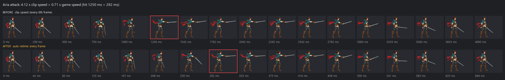
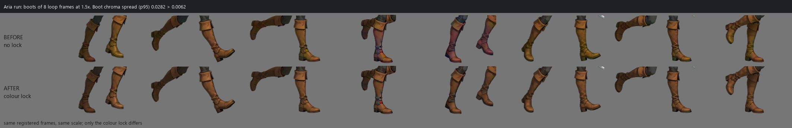

# Validation record — 2026-10-06 (0.4.0)

Two live validations ran on 2026-10-06, both local only: nothing was pushed, tagged or published, and these runs are the record.

1. **Live validation 1** (morning): the release check of branch `asf/integration` at `2824c1b`, with three fresh host sessions (Codex, Grok image-to-video, Claude Code with the plugin).
2. **Live validation 2** (afternoon): the redone pipeline (image generation first, master still, `sprite_set.py`, finish) on two characters, Aria (HD) and a chibi pixel fox (fox2). The 0.4 README showcase comes from this run.

## Automated results

Release check of `asf/integration` at `2824c1b`, before the docs commit:

| Check | Command | Result |
| --- | --- | --- |
| Python suite, serial | `python -m pytest -q` | 2610 passed |
| Fresh clone | `git clone`, `pip install -r requirements-dev.txt`, then the suite | green |
| Python 3.10 floor | full suite under a Python 3.10 interpreter | green |
| Without scipy | suite with the numpy fallbacks (`FORGE_CORE_NO_SCIPY=1`) | green |
| JavaScript | `node --test "tests/js/*.test.mjs"` (node 22.15) | 83 passed |
| Plugin manifest | `claude plugin validate --strict .` (Claude Code 2.1.289) | passed |
| Vendored copies | `python tools/vendor_sync.py --check --strict` | in sync |
| Skill packages and links | `python -m pytest tests/test_skill_packages.py`; `python tools/check_links.py` | passed; 0 broken links, every README image exists |

Final tree (`3096154`, the base of the README commit), run locally on the same machine:

| Check | Command | Result |
| --- | --- | --- |
| Python suite, serial | `python -m pytest -q` | 3063 passed, 9 skipped (the 3 `bench` tests deselected), 25 min |
| JavaScript | `node --test "tests/js/*.test.mjs"` (node 22.15) | 83 passed |
| Vendored copies | `python tools/vendor_sync.py --check --strict` | in sync (28 copies) |
| Skill packages and links | `python -m pytest tests/test_skill_packages.py`; `python tools/check_links.py` | passed; 0 broken links |

The repository has no CI; every check above runs locally. Opt-in markers (`bench`, the headless-browser checks) are not part of these counts. The `bench` tests reproduce the keyer, loop and palette numbers quoted in the [CHANGELOG](../CHANGELOG.md) on the owner's evidence clips and need their paths in `FORGE_BENCH_*` variables.

Environment: Windows 11, Python 3.13.2, numpy 2.5.3, Pillow 12.3.0, scipy 1.18.1, resvg-py 0.5.0, ffmpeg 8.0.1, node 22.15.0; codex-cli 0.155.1, grok 1.0.40.

## README showcase

- `src/v040/`: Aria's master still and takes, `aria-set.gif`, `aria-in-scene.gif`, the attack and colour-lock before/after, the fox comparison and the fox sheet. All of it comes from live validation 2. Aria was re-rendered with the final code (`3096154`) from her registered frames (no new generation): every action HD-finished with the colour lock, the one-shots auto-retimed, the loops as `gait_loop` selected them, then packaged and verified. The scene background is one more Codex CLI image from the same run.
- `src/validation/grok-old-vs-new-*`: the keyer comparison from live validation 1, section 2.
- `src/codeart/` (the README's last-resort row) was rendered with no image model and no quota, from the shipped examples:
  - `hero-walk.gif`: `rig_animate.py --anim skills/codeart2d/examples/hero.anim.json --build-clips --strict-qc` (QA pass, walk frames upscaled 4x on a dark background).
  - `fx-set.gif`: `fx_build.py --spec skills/codeart2d/examples/slash.fx.json --build-clips` (QA pass; slash, impact, dust and orb side by side, 3x).
  - `meadow-layout.png`: `autotile_build.py --material-spec skills/codeart2d/examples/dirt-path.material.json --strict-qc` (seam proof 0 mismatches), then `layout_build.py` on `meadow-layout.json` with its `path` material named `dirt` to match that tileset, `--tiles <wang81 tileset> --preview --strict-qc` (QA pass, every exit reachable).

## Live validation 1: cross-host check of the integration tree

Cross-host runs with the owner's local tools (Codex, Claude Code, Grok CLI) under the owner-approved caps. Every call went into the ledger, and no credential file was read.

The owner asked for a lean, key-only set: three fresh sessions with no history, each on the 0.4.0 tree (`asf/integration`). Quota actually used: 0 Codex images, 1 Grok video, 0 paid API calls, and one Claude Code session (US$1.32). The baseline is the 2026-10-05 cold-start test on the old skill (cfed170).

At that time small pixel sprites were routed to `codeart2d` first. The owner reversed that routing the same day (image generation first, code art only as the last resort); live validation 2 redid the fox with image generation.

### 1. Codex host: the fox-run request from the cold test

`codex exec` (codex-cli 0.155.1, workspace-write, image tool enabled) got the same request: an 8-frame side-view pixel fox run in 48x64 cells at 80 ms. It finished on its own in 11 min 09 s (exit 0). Under the routing of the time, the 45–46 px fox went to `codeart2d` and used 0 image generations.

  

| `sheet_qc`, run from 0.4.0 | old run | 0.4.0 run |
|---|---|---|
| Cross-cell tail / boundary band / specks | fail (1 / 246 px / 7) | pass (0 / 0 / 0) |
| Head-scale identity | fail (0.918–1.0) | pass (1.00 on 8/8) |
| Colours per frame / partial-alpha pixels | 594–709 / 7,547 | 20–21 / 0 |
| Loop seam (max / median step) | 1.38 | 1.27 |
| Manual fixes | 1 hand-made crop box | 0 |
| Leg alternation | fail (duplicated half-cycle) | unclear (near-duplicate half-cycle frames) |

Trade-off: the image-model fox reads livelier. The live fix pass added a walk/run half-cycle duplicate warning and near/far-leg contrast guidance to codeart2d. The image-sheet path (`sheet_qc` → `process` → `scale_frames`) was not exercised live on Codex in this run.

### 2. Grok image-to-video through video2dsprite

Same character as the cold test. Steps: `key-plan`, then `prepare_i2v_input` (1280x720, root fixed), then `cli_media.py video --route grok-acp --execute`. That took 49.4 s, returned 1280x720 at 24 fps with 145 frames, and recorded the route proof. Then the soft matte, `register_clip apply`, `gait_loop select`, `retime`, `package png,webm,packed`, `verify` (49 checks) and `validate_animation`, all passing. The old cfed170 keyer ran on the same new clip for comparison.

  
  

| Same clip | old keyer | 0.4.0 |
|---|---:|---:|
| Outer-ring fringe (mean / worst) | 0.704 / 0.810 | 0.000 / 0.000 |
| Opaque key pixels leaked | 7,780 | 0 |
| Enclosed key pockets | 19 | 0 |
| Alpha flips per frame pair | 22.3 | 3.38 |
| Keying time, 145 frames | 271 s | 44 s |
| Loop | none (whole clip rejected: wrap 1.96) | auto 74–88, wrap 1.016, root drift 0.31 %/loop |

Known gaps:
- Grok ignored the requested start and end holds.
- A faint blue-violet tint remains on one navy edge, and `matte_qa` does not count it.
- The live fix pass made `prepare_i2v_input` accept an opaque master on a key colour and fixed the subject-phrase bug in the prompt contract.

### 3. Claude Code host with the plugin

`claude -p --plugin-dir <repo>` got one zh-TW sentence: 32x32 slime with idle and jump, a hit FX, and a 16x16-tile grass and water map with collision. It finished in 180 s (US$1.32), exit 0, with 0 permission denials.
- The plugin skills triggered: `generate2dsprite` and `generate2dmap`, routed (under the routing of the time) to `codeart2d`.
- The reply disclosed the art as code-drawn, and every `codeart-meta.json` has `art_source=code`.
- Exports: Aseprite, Godot and Tiled.
- Independent checks: `map_bundle validate` pass (0 errors, 0 warnings); `map_nav check` reachable, with 2 one-cell pockets.
- The hit FX published with a QA warn (`l_corners` 13 > 10) that the reply summarised as "all checks passed". The live fix pass now requires WARN results to be reported verbatim.

  
  

Baseline: the old skill had no Claude Code route. It offered only the host image tool or a paid API, and shipped no plugin and no codeart2d.

## Live validation 2: one still → a sprite set

The redone pipeline, run end to end by the release agent with the branch's tools on two characters. No API key was configured, so every image came from the local Codex CLI (`image_gen`) and every clip from the Grok CLI in ACP mode: subscription quota only, US$0 of API spend. Every call is a line in the project ledger.

| | Codex CLI images | Grok clips | Failed requests |
|---|---:|---:|---:|
| Aria master (3 takes) | 3 | | |
| Aria set (6 actions) | | 34 | 8 Grok (4 s requests) |
| Scene background | 1 | | |
| First pixel fox (master, idle and run) | 5 | 6 | 6 Codex edits (Windows) |
| fox2 master (2 generate runs × 3 takes, 2 edit runs × 2) | 10 | | |
| fox2 set (idle, run) and three run-prompt variants | | 7 | |

The tree moved during the run: the run found these bugs, each was fixed and committed, and the affected steps were re-run. `sprite_set` passed the clip length as `6.0`, gave `finish_frames.py` both `--scale-ref` and `--target-height`, and had no per-character matte profile; the residue gate counted a crimson outline as magenta spill; every Codex edit on Windows failed with ARTIFACT_MISSING (the Codex sandbox could not read the run folder); and the 8 failed Grok requests asked for 4 s clips, which Grok cannot render (6 or 10 s only), so they ended as a bare GENERATION_FAILED (the route now snaps the length). The quality fixes (one-shot retime, colour lock, bold pixel finish, recalibrated QC, the spaced palette) were measured on this run's real frames afterwards, without regenerating anything.

### Aria: an HD heroine, six actions

Master: `master_still.py generate --takes 3` through `route_media.py` (local Codex CLI, 41–45 s per take); take 1 was approved without an edit. Set: `sprite_set.py plan` (idle, walk, run, attack, jump, hurt; HD finish at 256 px; a matte profile for the crimson scarf on the magenta key), then `run`, `review` and `accept`.

| Action | Takes | What happened | Accepted | Final, re-rendered with `3096154` |
|---|---:|---|---|---|
| idle | 1 | passed every gate | take 1; no closing cycle, so `gait_loop` chose a ping-pong over frames 0–50 (confidence medium) | loop, 99 frames, 4.13 s |
| walk | 3 | takes 1–2 passed the gates, but the review saw purple and green bleed on the boots and leggings; take 3 is take 2's clip re-keyed with a despill-all profile | take 3; an olive tint stays on the boots in a few frames; loop confidence low | loop, 41 frames, 1.71 s |
| run | 10 | takes 1–6 rejected (the old identity floor, one edge touch, one feet drift); 7–8 failed to generate; 9 passed, but the review asked for boots that keep one colour; 10 passed | take 10: a real run with arm pump and a flight phase; the boots still shimmer olive and maroon and the free hand turns pinkish in a few frames, after 4 rounds of prompt fixes | loop, 28 frames, 1.17 s |
| attack | 9 | take 1 passed the gates, but the review saw the sword change shape and blur; 2–4 and 7–8 rejected (identity, one edge touch); 5–6 failed to generate | take 9, frames 0–99: one clean thrust with one sword; in the clip the thrust is held about 1.7 s | one-shot, 17 frames, 0.71 s, hit at 292 ms (clip speed: 99 frames, 4.13 s, hit at 1.25 s) |
| jump | 11 | every take rejected by the old identity floor (head pose), two also by the turn gate; 7–8 failed to generate | take 11, frames 0–127, accepted by review: crouch, tucked jump, landing; the hair spikes while falling | one-shot, 22 frames, 0.92 s (clip speed 5.33 s) |
| hurt | 10 | take 2 passed the gates, but the review found the flinch too small; 1, 3–5 and 9–10 rejected (identity); 7–8 failed to generate; take 6 is take 3's clip re-keyed with the matte profile | take 6, frames 33–127: a clear flinch and hunch with an exact return to rest; in the clip the hunch is held about 2.2 s | one-shot, 12 frames, 0.50 s (clip speed 3.92 s) |

All six final packages pass `engine_export.py verify`. The one-shot timings match the measurement made on the live frames (attack 4.1 s → 0.7 s, jump 5.3 s → 0.9 s, hurt 3.9 s → 0.5 s), and so does the colour lock on the run loop:

| Aria's run loop (24 frames) | no lock | colour lock |
|---|---:|---:|
| Hue flips per frame pair | 351.6 | 169.6 |
| Region chroma spread (mean) | 0.0059 | 0.0012 |
| Boot chroma spread (p95) | 0.0282 | 0.0062 |
| Boot chroma step (median) | 0.0243 | 0.0031 |

  
   
  

QC recalibration: 42 takes of this run were labelled from the review (Aria's 36: 18 good, 18 bad; the first pixel fox's 6, all good). The old gates rejected 31, among them 18 of the 24 good takes; 29 of the 31 failed the identity floor. The recalibrated gates reject 9: none of the good takes, and 9 of the 18 bad ones (precision 0.42 → 1.00, recall 0.72 → 0.50). The new colour gate rejects six bleed takes. The nine bad takes it lets through (colour drift on the boots and leggings, a bent or doubled sword, a flinch too small, specks beside the sword) are caught only by looking at the sheets, which is why the review step stays mandatory.

What stayed weak:
- **Retakes.** Six actions took 44 clips (34 generated, 8 failed requests, 2 re-keyed). Many rejections came from the old identity floor, which is fixed, but run, attack and jump also had real problems: colour bleed on fast legs, a sword that changed shape, turned heads, an edge touch.
- **Colour on fast limbs.** Grok shifts the boots and the free hand on fast frames. The colour lock halves the hue flips and removes most of the boot shimmer; it does not make them zero.
- **Slow motion.** Grok played every one-shot in slow motion with long holds, and prompt clauses asking for a quick attack or jump did not change that. The auto retime fixes the timing after the fact; the motion itself (the falling hair in the jump) is what Grok drew.
- **Loops.** The idle has no closing cycle (a ping-pong instead), and the walk loop's confidence is low.
- **Pinned end frames.** The Grok CLI route cannot pin a last frame (`lastFrameUsed: false`), so idle and attack were not pinned to the master.
- **Two actions from re-keyed clips.** Walk and hurt were accepted from earlier clips re-keyed with a different matte, through the supplied-clip flow, not from a fresh take that passed.

### fox2: a chibi pixel fox (the cold-test request, redone)

The 2026-10-05 cold-test request again (an 8-frame side-view pixel fox run in 48x64 cells at 80 ms), this time through image generation.

A first pixel fox earlier in the run finished with the pixel finish of the time: 155–162 colours per frame from a 255-colour palette, with near-duplicate shades that read as speckle at 4x. That result led to the bold pixel finish and the spaced palette; fox2 redid the character from a new master.

- **Master.** Two `generate` runs of 3 takes (one with the old fox as a style reference), then two `edit` runs of 2 takes to fix the eye; the approved master is the second edit of take 2. All 10 images came from the local Codex CLI; the Windows edit fix made the edits possible.
- **Set.** `sprite_set.py` with the pixel finish (46 px body, 48x64 canvas, 32 colours, selective outline, colour lock, 12.5 fps). Idle passed in one take. The three run takes passed every gate, but `gait_loop` found no repeating gait in any of them ("the lag profile is flat ... the motion does not repeat"), so no loop could be cut. Three more Grok runs with rewritten prompts (an energetic in-place sprint) were made outside the set; the second was adopted as run take 4, and `gait_loop` found a 16-frame cycle in it (frames 14–30, 667 ms, confidence medium).
- **Final.** Every second frame of that cycle (8 frames) → `finish_frames.py pixel` (the spaced palette learned 20 colours) → `retime.py` at exactly 80 ms → `engine_export.py package` and `verify` → `validate_animation.py` → Aseprite, Godot SpriteFrames and Sprite3D exports, plus 8x1 and 4x2 sheets.

| fox run, 48x64, 8 frames, 80 ms | 2026-10-05 cold test | fox2 |
|---|---:|---:|
| Colours per frame (alpha ≥ 128) | 594–709 | 16–19 |
| Alpha levels | 199 | 2 |
| Lone pixels per frame (mean) | 732 | 75 |
| Loop seam step / mean step | 1.29 | 1.25 |

What stayed weak: the set's own retake loop could not produce a cycling run (the cycle came from a rewritten prompt run by hand and adopted into the set); the 8 frames were taken by hand as every second frame of the selected cycle; the seam is still about a quarter larger than an average step, a small visible hitch at the wrap; and the Godot and Aseprite exports were not opened in the editors.

Artifacts for both validations are in the owner's local validation folders and are not committed; the README images come from them (`src/validation/`, `src/v040/`).

## What remains unproven

See [known-limitations.md](./known-limitations.md): editor imports, device playback, macOS, single-clip thresholds and live provider behaviour beyond the runs recorded above. No API provider was called live in these runs; the five adapters are verified against the vendors' documentation and mocked contract tests only.
